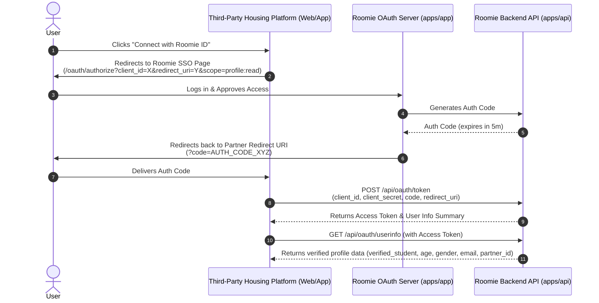

# Roomie Core Logic Specification: Badges, Connection Networks, SSO Auth, Checkout Consent, and Auto-Sharing Fees

This document outlines the detailed system design, database models, and API interfaces for the next generation of Roomie's core features. These features are designed to enhance roommate trust, enable seamless platform integration, establish safe exit mechanisms, and automate financial operations.

---

## 1. Roomie Badges & Connection Network

### 1.1 Overview & Objectives
Trust is the primary currency of roommate matching. While standard compatibility questionnaires help, peer verification, track records, and social proof provide absolute validation. 
- **Roomie Connection Network:** Map and analyze relationships between matched roommates. Similar to professional networking connections (1st, 2nd, 3rd degrees), this allows users to see mutual connections (e.g., "Connected to 2 of your friends") and check their reputation network.
- **Dynamic Badges:** Earnable badges that showcase verification status, financial reliability, and community standing.
  - **Roomie Badge:** Special badge assigned when a roommate agreement is successfully paid. It is visible **only in their private chat thread** to represent their active confirmed connection. Confirmed roommates can **customize the badge's color, variant, and theme styling** directly from the chat interface to represent their joint identity.
- **Scoped Housing Access:** Housing features do not unlock globally for a user. Instead, housing is unlocked **strictly for a specific confirmed Roommate Agreement** connection.
  - **Mobile:** Users can only access housing via the confirmed roommate's private chat header. Direct access to `/housing` on mobile displays a guide prompt directing users to their roommate chat thread.
  - **Desktop:** Accessing `/housing` prompts the user to select which confirmed roommate connection/agreement to use for browsing.
  - **Provider Redirection:** Upon clicking a housing provider, the user is redirected with query parameters: `roomie_id` (the unique roommate connection Roomie ID), `roommate_id` (roommate's username), and `agreement_id` (roommate agreement UUID) to establish a joint renter profile.

### 1.2 Database Schema (Prisma)
We will extend the existing `profiles` model and introduce new models for `badges` and `user_badges`.

```prisma
// Add to profiles model:
model profiles {
  // ... existing fields ...
  user_badges         user_badges[]
  network_size        Int                   @default(0)
}

// New Model for Badges
model badges {
  id                  String                @id @default(dbgenerated("gen_random_uuid()")) @db.Uuid
  code                String                @unique // e.g., "VERIFIED_STUDENT", "GOOD_PAYER", "ROOMIE_PARTNER", "HOUSING_ALUM"
  name                String
  description         String
  icon_lottie         String?               // Reference to Lottie animation file (e.g., "verified-badge.json")
  icon_svg            String?
  category            String                @default("SYSTEM") // SYSTEM, COMMUNITY, HOUSING, SPONSOR
  created_at          DateTime              @default(now()) @db.Timestamptz(6)
  user_badges         user_badges[]
}

// Map user achievements to badges
model user_badges {
  id                  String                @id @default(dbgenerated("gen_random_uuid()")) @db.Uuid
  user_id             String                @db.Uuid
  badge_id            String                @db.Uuid
  awarded_at          DateTime              @default(now()) @db.Timestamptz(6)
  metadata            Json?                 @default("{}") // e.g. reference to the booking or bill split
  profiles            profiles              @relation(fields: [user_id], references: [id], onDelete: Cascade)
  badges              badges                @relation(fields: [badge_id], references: [id], onDelete: Cascade)

  @@unique([user_id, badge_id])
}
```

### 1.3 Badge Inventory & Issuance Rules

| Badge Code | Name | Description | Issuance Logic | Lottie Animation / UI |
| :--- | :--- | :--- | :--- | :--- |
| `VERIFIED_STUDENT` | Verified Student | Identity and enrollment verified via student ID. | Approved by Super Admin after ID upload. | `verified-badge.json` |
| `ROOMIE_PARTNER` | Roomie Partner | Successfully entered a paid roommate agreement. | Automatically awarded upon Paystack success of a Roommate Agreement. Visible **only in their private chat**. | Custom "Roomie" pill / `match-found.json` |
| `GOOD_PAYER` | On-Time Payer | Settles bills reliably and quickly. | `bill_split_items` paid within 48h of split creation, for at least 5 consecutive items. | `bill-settled.json` |
| `HOUSING_VERIFIED` | Verified Resident | Resident status verified by a housing platform provider. | Housing provider checks a box in Admin Panel confirming active tenancy. | `shield-check.json` |
| `COMMUNITY_VIBE` | High Vibe | Active contributor on the feed. | Post count > 10 and likes received > 50. | `star-pulse.json` |

### 1.4 Connection Network Logic
When two users transition their [connections](file:///c:/Users/admin/Desktop/Roomie/apps/api/prisma/schema.prisma#L61-L80) status to `ACTIVE` (after signing a [roommate_agreement](file:///c:/Users/admin/Desktop/Roomie/apps/api/prisma/schema.prisma#L306-L324) and paying), they form a **1st-Degree Connection**.
- **1st-Degree:** Roommates you have lived with or have active roommate agreements with.
- **2nd-Degree:** Roommates of your roommates (connected to your roommates, but not directly to you).
- **Mutual Connections:** Displayed on profile cards in the Discover feed to establish social safety (e.g. *"Matched with 2 mutual connections"*).

#### Network API Endpoint:
- `GET /api/network/mutual/:userId`
- Returns array of profile objects representing shared 1st-degree connections.

---

## 2. Roomie ID for SSO Auth & Profile Sharing

### 2.1 Overview & Objectives
Students shouldn't have to fill out the same onboarding forms (budget, study details, lifestyle habits, ID uploads) when applying to housing agencies (e.g., UniHousing, Hostels.ng).
- **Roomie ID (Connection-Scoped):** For every roommate connection (confirmed agreement), a unique joint Roomie ID is created representing this specific roommate pair. When browsing housing, this joint Roomie ID is shared with the housing providers.
- **SSO Authentication & Dual Accounts:** Third-party partners can embed a "Sign In with Roomie ID" button. Upon authentication, a dual account is established on the partner housing provider's platform using the unique Roomie ID as the primary identifier.
- **Unified Renter Passport:** The details of both roommates (individual profiles, budget range, lifestyle preferences, and verified student credentials) are sent together to the housing provider. This establishes a shared renting credibility passport, boosting validation score and streamlining joint tenancy approvals.
- **Customizable Roomie Badge:** The roommate badge associated with the connection is customizable. Roommates can collaboratively select custom colors or visual variant themes directly in their chat to display their joint connection status.

### 2.2 Database Schema (Prisma)
We will add OAuth client fields to the [housing_platforms](file:///c:/Users/admin/Desktop/Roomie/apps/api/prisma/schema.prisma#L107-L128) model and create tracking models for authorization codes and tokens.

```prisma
// Add to housing_platforms:
model housing_platforms {
  // ... existing fields ...
  client_id           String?               @unique @default(dbgenerated("gen_random_uuid()"))
  client_secret       String?               // Hashed secret key
  redirect_uris       String[]              @default([])
  allowed_scopes      String[]              @default(["profile:read", "verification:read", "network:read"])
  
  oauth_auth_codes    oauth_auth_codes[]
  oauth_tokens        oauth_tokens[]
}

// OAuth Authorisation Codes
model oauth_auth_codes {
  id                  String                @id @default(dbgenerated("gen_random_uuid()")) @db.Uuid
  code                String                @unique
  client_id           String
  user_id             String                @db.Uuid
  redirect_uri        String
  scope               String[]
  expires_at          DateTime              @db.Timestamptz(6)
  used                Boolean               @default(false)
  created_at          DateTime              @default(now()) @db.Timestamptz(6)
  
  profiles            profiles              @relation(fields: [user_id], references: [id], onDelete: Cascade)
  housing_platforms   housing_platforms     @relation(fields: [client_id], references: [client_id], onDelete: Cascade)
}

// OAuth Access Tokens
model oauth_tokens {
  id                  String                @id @default(dbgenerated("gen_random_uuid()")) @db.Uuid
  access_token        String                @unique
  refresh_token       String?               @unique
  client_id           String
  user_id             String                @db.Uuid
  scope               String[]
  expires_at          DateTime              @db.Timestamptz(6)
  created_at          DateTime              @default(now()) @db.Timestamptz(6)
  
  profiles            profiles              @relation(fields: [user_id], references: [id], onDelete: Cascade)
  housing_platforms   housing_platforms     @relation(fields: [client_id], references: [client_id], onDelete: Cascade)
}
```

### 2.3 OAuth SSO Flow



### 2.4 Profile API Endpoint
- **Route:** `GET /api/oauth/userinfo`
- **Auth:** `Bearer <access_token>`
- **Response Shape:**
  ```json
  {
    "roomie_id": "@john_doe",
    "display_name": "John Doe",
    "email": "john@unilag.edu.ng",
    "identity_status": {
      "student_verified": true,
      "verification_status": "VERIFIED",
      "verified_at": "2026-06-15T12:00:00Z"
    },
    "demographics": {
      "age": 21,
      "gender": "male",
      "university": "UNILAG",
      "faculty": "Science",
      "year_of_study": 3
    },
    "preferences": {
      "min_budget": 80000,
      "max_budget": 150000,
      "lifestyle_tags": ["quiet", "no_smoking"]
    },
    "current_roommate_partner": {
      "id": "partner-uuid-123",
      "roomie_id": "@jane_smith",
      "display_name": "Jane Smith"
    }
  }
  ```

---

## 3. Roomie Consent Before Housing Check-out

### 3.1 Overview & Objectives
Living together involves joint financial liabilities. When a roommate checks out of a property, doing so unilaterally can leave the remaining roommate with full rent obligations, unpaid utilities, or deposit forfeitures.
- **The Checkout Consent Workflow:** Triggers an digital check-out process that requires joint agreement.
- **Safety Safeguard:** Caution deposits held by housing providers are locked until both roommates confirm checkout and verify that no outstanding shared bills or room damages exist.

### 3.2 Database Schema (Prisma)
```prisma
enum checkout_status {
  INITIATED
  REJECTED
  APPROVED
  COMPLETED
}

model checkout_requests {
  id                  String                @id @default(dbgenerated("gen_random_uuid()")) @db.Uuid
  connection_id       String                @db.Uuid
  initiator_id        String                @db.Uuid
  co_roommate_id      String                @db.Uuid
  platform_id         String?               @db.Uuid // Linked housing platform
  checkout_date       DateTime              @db.Date
  status              checkout_status       @default(INITIATED)
  
  // Checklist verification items
  checklist           Json                  @default("{\"bills_settled\": false, \"keys_returned\": false, \"no_damages\": true}")
  damages_reported    String?
  rejection_reason    String?
  
  created_at          DateTime              @default(now()) @db.Timestamptz(6)
  updated_at          DateTime              @default(now()) @db.Timestamptz(6)

  connections         connections           @relation(fields: [connection_id], references: [id], onDelete: Cascade)
  initiator           profiles              @relation("initiator_checkouts", fields: [initiator_id], references: [id])
  co_roommate         profiles              @relation("coroommate_checkouts", fields: [co_roommate_id], references: [id])
  platform            housing_platforms?    @relation(fields: [platform_id], references: [id])
}
```

### 3.3 Checkout Consent Workflow
1. **Initiation:** User A taps "Check out" in the app, entering the planned move-out date and ticking off a checklist.
2. **Request Delivery:** User B (co-roommate) is notified via Web Push. The app dashboard shows the active checkout request.
3. **Verification & Audit:** User B checks the state of shared bills. If User A has unpaid balances or damaged the flat, User B can Reject the request with a detailed log.
4. **Approval:** If User B accepts, both checkouts match. The system fires a webhook to the partner Landlord/Agency API letting them know checkout is verified, initiating caution deposit splits automatically.

---

## 4. Roomie House Fee Autosharing

### 4.1 Overview & Objectives
Large shared bills (rent, agency fees, security deposit) are a source of friction. Instead of one roommate paying 100% and chasing the other for manual bank transfers:
- **Split-Payment Routing:** Integration with Paystack's Subaccount API splits rent invoices.
- **Joint Clearance:** Rent/booking status remains "Pending" until both roommates settle their individual shares.
- **Escrow Refund Auto-splits:** Refundable caution fees are returned to each roommate's personal bank account in the exact auto-share ratio, approved after checkout consent is marked `APPROVED`.

### 4.2 Database Schema (Prisma)
We will extend [bill_splits](file:///c:/Users/admin/Desktop/Roomie/apps/api/prisma/schema.prisma#L32-L46) to support automated platform splits and add `recurring_splits` for ongoing bills.

```prisma
// Extension to bill_splits:
model bill_splits {
  // ... existing fields ...
  is_housing_fee      Boolean               @default(false)
  platform_id         String?               @db.Uuid // Linked housing platform
  payment_reference   String?               @unique  // Parent payment ref for landlord tracking
  split_ratio         Json                  @default("{\"initiator\": 0.5, \"acceptor\": 0.5}")
}

// Recurring split configurations (e.g. monthly WiFi, electricity)
model recurring_splits {
  id                  String                @id @default(dbgenerated("gen_random_uuid()")) @db.Uuid
  connection_id       String                @db.Uuid
  title               String
  amount              Int                   // Base amount in kobo
  billing_day         Int                   // 1-28 representing the monthly day it triggers
  active              Boolean               @default(true)
  created_at          DateTime              @default(now()) @db.Timestamptz(6)
  
  connections         connections           @relation(fields: [connection_id], references: [id], onDelete: Cascade)
}
```

### 4.3 Shared Payment Workflow (Paystack Split Charge API)

```
        Rent Invoice Issued (₦400,000)
                     │
                     ▼
          [Roomie Auto-Split]
                     │
      ┌──────────────┴──────────────┐
      ▼                             ▼
Roommate A Portion            Roommate B Portion
   (₦200,000)                    (₦200,000)
      │                             │
      ▼                             ▼
Paystack Subaccount Payment   Paystack Subaccount Payment
      │                             │
      ▼                             ▼
  [✔ Paid]                      [✔ Paid]
      │                             │
      └──────────────┬──────────────┘
                     ▼
   Tenancy Automatically Confirmed to Landlord
```

---

## 5. Next Steps for Implementation

1. **Prisma Migrations:** Create a migration script applying these schema changes to the Docker-based PostgreSQL database.
2. **NestJS Route Scaffolding:** Implement the endpoints in `apps/api/src/modules/` under `network`, `oauth`, `checkouts`, and `splits`.
3. **PWA Integration:** Add screens for checkout consent lists and split rent payments in `apps/app`.
4. **Third-Party Mocking:** Build a simple test portal mimicking a housing agency to test OAuth / SSO callbacks and webhook responses.
