# Roomie — Current System Architecture and Application Flows

> **Repository snapshot:** 2026-09-24  
> **Scope:** Current repository implementation, configuration, migrations, and operational notes.  
> **Important:** This document describes what is wired in the repository today. The NestJS backend migration described in `BackendMigration.md` is not yet the active application path.

## 1. Executive summary

Roomie is a Node.js monorepo for a student roommate discovery and management platform. It contains:

- `apps/web`: public marketing and waitlist website.
- `apps/app`: authenticated student product and PWA.
- `apps/admin`: provider and super-admin dashboard.
- `apps/docs`: product/integration documentation site.
- `apps/api`: NestJS/Prisma backend migration scaffold.
- `packages/db`: Supabase browser/server clients and typed data queries.
- `packages/ui`, `packages/animations`, `packages/config`, `packages/*-config`: shared frontend packages.
- `supabase`: local Supabase configuration, SQL migrations, snapshots, and seed data.

### Current runtime boundary

The main product currently uses Supabase directly:

1. Next.js renders the app surfaces.
2. `@supabase/ssr` maintains the authenticated browser/server session in cookies.
3. `@repo/db` creates browser and server Supabase clients.
4. Product and admin screens query Supabase tables, storage, auth, and realtime.
5. Next.js route handlers implement selected server-side operations such as payment webhooks, push delivery, agreement transitions, and receipt uploads.

`apps/api` is a parallel NestJS implementation target. It has modules and route placeholders, but most services return empty data or placeholder responses and the frontends do not consistently call it.

## 2. High-level architecture

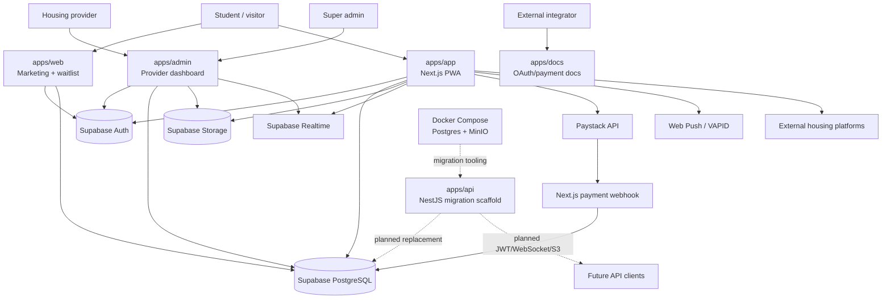

### 2.1 Active runtime flow in the current repository

The currently used runtime path is Supabase-first and browser-driven. The student app, admin app, and public web app all interact with the same Supabase project through authenticated browser/server clients. The NestJS API remains a later-stage migration target rather than the live application backend.

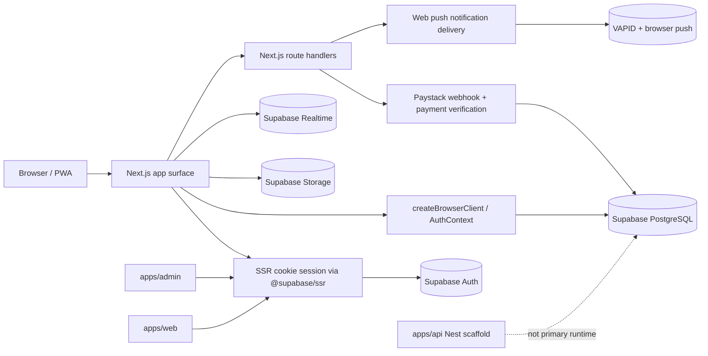

### 2.2 Local setup and startup sequence

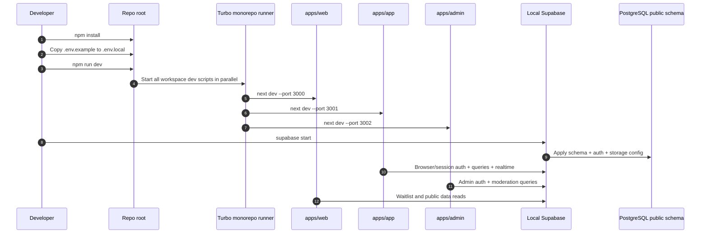

## 3. Repository and application surfaces

| Surface | Current responsibility | Main entry points |
|---|---|---|
| Marketing | Landing page, pitch deck, waitlist, terms/privacy | `apps/web/app`, `apps/web/src` |
| Student app | Auth, onboarding, discovery, feed, connections, chat, agreements, housing, splits, notifications, PWA | `apps/app/app`, `apps/app/src` |
| Admin | Provider registration, approval, analytics, student moderation, broadcasts, appeals | `apps/admin/app` |
| Docs | OAuth, checkout, profile, network, split and passport documentation | `apps/docs/content`, `apps/docs/src/content.ts` |
| Nest API | Intended REST/WebSocket replacement backend; currently scaffolded | `apps/api/src` |
| Shared DB package | Supabase client factories and query helpers | `packages/db/src` |
| Database | Schema evolution, RLS, triggers, realtime, seed data | `supabase/migrations`, `supabase/seed.sql` |

## 4. Tooling and setup

### 4.1 Required toolchain

- Node.js `>=20` (root `package.json`; README also mentions Node 18+).
- npm `11.14.1` is declared as the package manager and `package-lock.json` is committed.
- TypeScript `5.9.2`.
- Turbo `2.8.10`.
- Next.js `16.2.1` in the frontend apps.
- Supabase CLI for local database/auth/storage/realtime development.
- Docker Desktop is needed for the optional PostgreSQL/MinIO migration stack.

### 4.2 Install and run the current Supabase-backed system

```powershell
npm install
Copy-Item .env.example .env.local
# Create app-specific .env.local files when required by the deployment.
npm run dev
```

The root `dev` script runs all Turbo `dev` tasks in parallel:

| App | Development port |
|---|---:|
| `apps/web` | 3000 |
| `apps/app` | 3001 |
| `apps/admin` | 3002 |
| `apps/api` | Nest default from `PORT`, otherwise 4001 |

The docs app has a package but no root `dev` script override documented in the repository; run its Next command from `apps/docs` when needed.

### 4.3 Validation commands

```powershell
npm run lint
npm run check-types
npm run build
```

The API package also defines:

```powershell
npm --workspace api run test
npm --workspace api run test:e2e
```

### 4.4 Local Supabase setup

`supabase/config.toml` enables local API, PostgreSQL, Studio, Auth, Realtime, Storage, and Inbucket. Important local ports:

| Service | Port |
|---|---:|
| Supabase API | 54321 |
| PostgreSQL | 54322 |
| Supabase Studio | 54323 |
| Inbucket UI | 54324 |
| SMTP | 54325 |
| POP3 | 54326 |
| Edge runtime inspector | 8083 |

Typical database reset:

```powershell
supabase start
supabase db reset
```

The SQL migrations in `supabase/migrations` are the authoritative evolution history. `supabase/seed.sql` and `supabase/data_snapshot.sql` provide local/fixture data.

### 4.5 Optional Docker migration stack

`docker-compose.yml` starts:

- PostgreSQL 16 as `roomie_postgres` on host port `5433`.
- MinIO as `roomie_minio` on ports `9000` (S3 API) and `9001` (console).

```powershell
docker compose up -d
```

This stack is for the planned Supabase-to-NestJS migration and is not the current browser application backend. The compose database is separate from the Supabase local database unless explicitly configured otherwise.

### 4.6 Environment configuration

The main variables are documented in `.env.example`:

- `NEXT_PUBLIC_SUPABASE_URL`, `NEXT_PUBLIC_SUPABASE_ANON_KEY`: browser-safe Supabase connection.
- `SUPABASE_SERVICE_ROLE_KEY`: server-only privileged Supabase access.
- `NEXT_PUBLIC_PAYSTACK_PUBLIC_KEY`, `PAYSTACK_SECRET_KEY`: connection/agreement payments.
- `NEXT_PUBLIC_VAPID_PUBLIC_KEY`, `VAPID_PRIVATE_KEY`, `VAPID_SUBJECT`: browser push notifications.
- `NEXT_PUBLIC_APP_URL`, `NEXT_PUBLIC_ADMIN_URL`, `NEXT_PUBLIC_WEB_URL`: surface URLs.
- `CONNECTION_FEE_KOBO`: configured connection/agreement fee.
- `UPSTASH_REDIS_REST_URL`, `UPSTASH_REDIS_REST_TOKEN`: planned/phase rate limiting.
- `GOOGLE_CLIENT_ID`, `GOOGLE_CLIENT_SECRET`: local Supabase Google OAuth.

Secrets must remain server-side and must not be exposed through `NEXT_PUBLIC_*` variables.

## 5. Authentication and request/session flow

The current student and admin authentication path is Supabase Auth, not the NestJS API.

- Browser clients are created once in `packages/db/src/client.ts`.
- Server clients use `@supabase/ssr` and Next.js cookies in `packages/db/src/server.ts`.
- `apps/app/src/context/AuthContext.tsx` subscribes to `supabase.auth.onAuthStateChange`.
- `apps/app/proxy.ts` refreshes the session cookie and protects explicit route prefixes.
- Email/password and Google sign-in components are in `apps/app/src/components/auth`.
- OAuth callbacks are handled by `apps/app/app/auth/callback/route.ts` and `apps/admin/app/api/auth/callback/route.ts`.
- The admin login additionally checks `admin_users` and provider records.

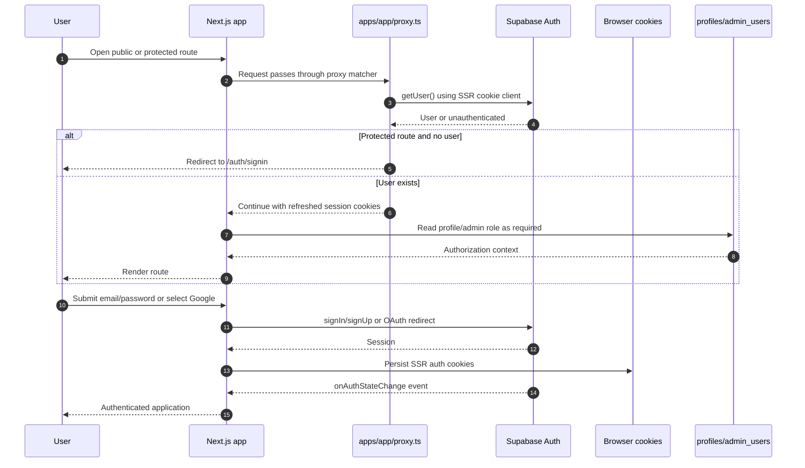

### Current authentication limitations

- `apps/api/src/auth/auth.service.ts` returns `null` and `auth.controller.ts` returns placeholders.
- Nest JWT guards exist as scaffolding but are not the active frontend auth path.
- Route protection is prefix-based in the Next.js proxy; individual server handlers also need their own authorization checks.

## 6. Database model and setup flow

The schema is PostgreSQL-based and currently hosted/managed through Supabase. The migration history contains profile, connection, message, payment, bill split, housing, notification, push subscription, moderation, feed, agreement, waitlist, and PWA-install tables.

Core entities:

- `profiles` links one-to-one to `auth.users`.
- `connections` joins two profiles and carries connection/payment status.
- `messages` belongs to a connection.
- `payments` records gateway references and status.
- `roommate_agreements` represents consent/commitment.
- `bill_splits` and `bill_split_items` track shared expenses.
- `posts`, `post_likes`, and `post_comments` implement the social feed.
- `housing_platforms`, `housing_listings`, and `platform_clicks` implement provider discovery/referrals.
- `notifications`, `push_subscriptions`, and triggers deliver notification state.
- `admin_users`, reports, appeals, blocks, waitlist, and PWA install tables support operations.

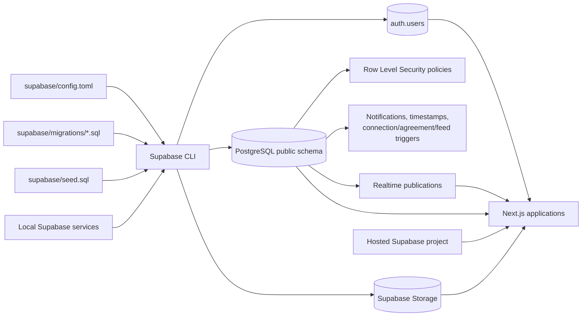

### Schema evolution sequence

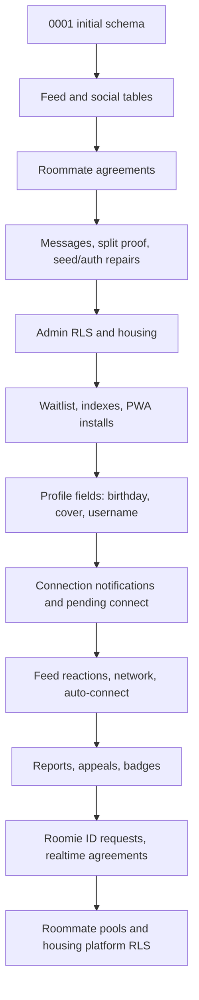

## 7. End-to-end student journey

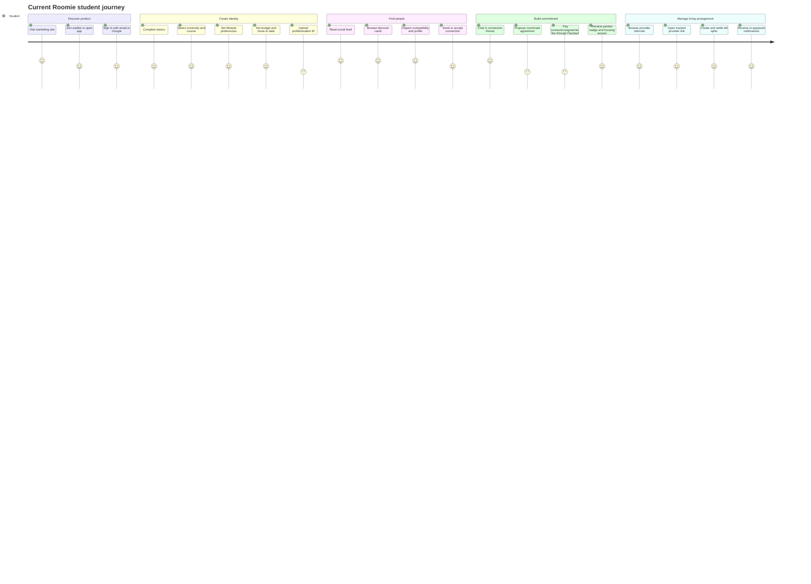

## 8. Onboarding flow

The implemented route sequence is under `apps/app/app/onboarding`:

`welcome → basics → university → vibe → budget → verify → success`

Each page is intended to save profile progress so a user can resume. The profile schema stores `onboarding_step` and `onboarding_complete`.

```mermaid
flowchart TD
    Start[/onboarding/welcome] --> Basics[/onboarding/basics]
    Basics --> Save1[(profiles: identity/location)]
    Save1 --> University[/onboarding/university]
    University --> Save2[(profiles: university/course/year)]
    Save2 --> Vibe[/onboarding/vibe]
    Vibe --> Save3[(profiles: lifestyle preferences)]
    Save3 --> Budget[/onboarding/budget]
    Budget --> Save4[(profiles: budget/move-in/gender preference)]
    Save4 --> Verify[/onboarding/verify]
    Verify --> Storage[(student-ids/profile media storage)]
    Verify --> Save5[(profiles: verification state)]
    Save5 --> Success[/onboarding/success]
    Success --> Feed[/feed]
    Success --> Discover[/discover]
```

## 9. Discovery, compatibility, and connections

Discovery uses profile data, filtering controls, compatibility scoring, network views, and profile detail routes. Compatibility helpers are in `packages/db/src/lib/compatibility.ts`.

```mermaid
flowchart TD
    D[/discover] --> Filters[City, university, gender,<br/>budget, lifestyle, verified]
    Filters --> Query[Profiles query / mock fallback during development]
    Query --> Cards[Profile cards]
    Cards --> Detail[/discover/:id or /discover/username/:username]
    Detail --> Score[Compatibility score]
    Detail --> Network[Mutual connections/network map]
    Detail --> Connect[Create connection request]
    Connect --> C[(connections)]
    C --> Notify[(notifications)]
    C --> Chat[/chat/:connectionId]
```

## 10. Connection, agreement, and payment flow

The repository contains both legacy connection payment terminology and the newer agreement flow. The current UI includes a Paystack component and agreement route handlers. Payment verification/webhook behavior must be treated as the source of truth at deployment time.

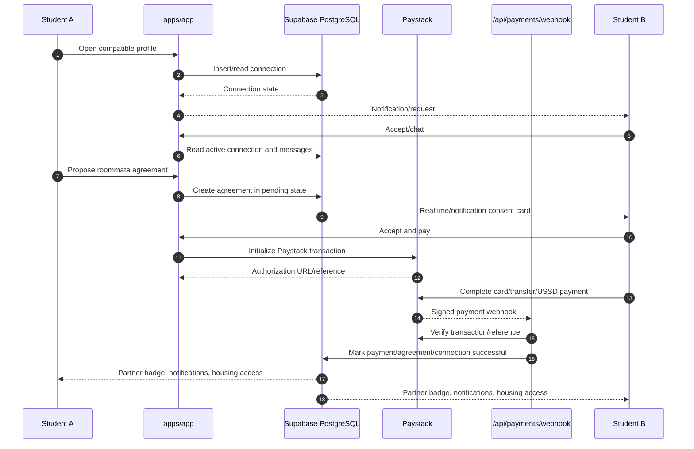

## 11. Chat and realtime flow

The current student UI uses Supabase data/realtime helpers in `apps/app/src/hooks/useMessages.ts` and related components. Agreement and notification migrations enable realtime database events. The Socket.IO gateway in `apps/api` is migration scaffolding, not the active chat transport.

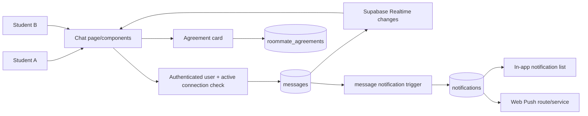

## 12. Social feed flow

```mermaid
flowchart TD
    Feed[/feed] --> Read[Read posts and author profiles]
    Read --> Posts[(posts)]
    Posts --> Reactions[(post_likes)]
    Posts --> Comments[(post_comments)]
    Composer[Post composer] --> Create[Create post]
    Create --> Posts
    Comment[Comment/reply composer] --> Comments
    Like[Like/unlike] --> Reactions
    Posts --> Profile[View author profile]
    Profile --> Discover[/discover/:id]
```

## 13. Bill split and receipt flow

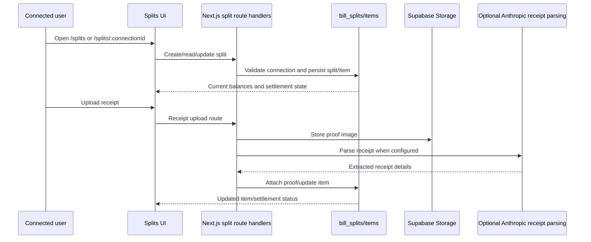

## 14. Housing provider and referral flow

```mermaid
flowchart TD
    Provider[Provider] --> Register[apps/admin/register]
    Register --> RegisterAPI[/api/providers/register]
    RegisterAPI --> Platforms[(housing_platforms: PENDING_REVIEW)]
    Super[Super admin] --> Approval[apps/admin/super/approvals]
    Approval --> Platforms
    Platforms -->|ACTIVE| Housing[/app/housing]
    Housing --> Click[/api/platforms/:id/click]
    Click --> Clicks[(platform_clicks)]
    Clicks --> Redirect[External provider URL]
    Provider --> Dashboard[Admin dashboard/analytics]
    Dashboard --> Clicks
```

Access to housing is intended to depend on a qualifying connection/agreement/payment state and is additionally enforced by database policies and application checks.

## 15. Notifications and PWA flow

```mermaid
flowchart TD
    Event[Message, connection, agreement, admin broadcast,<br/>or system event] --> DBTrigger[Supabase trigger/application route]
    DBTrigger --> Notifications[(notifications)]
    Notifications --> InApp[NotificationContext + /notifications]
    PushToggle[User enables push] --> Subscribe[/api/push/subscribe]
    Subscribe --> Subs[(push_subscriptions)]
    DBTrigger --> Send[/api/push/send]
    Send --> VAPID[Web Push service using VAPID private key]
    VAPID --> Browser[Installed browser/PWA]
    Install[Browser install event] --> Tracker[PWA install tracker]
    Tracker --> Installs[(pwa_installs)]
    SW[Serwist service worker] --> Cache[Offline/cache strategy]
```

## 16. Admin and moderation flows

Admin pages directly use Supabase clients and RLS-backed tables:

- Provider registration and approval.
- Provider profile/listing and referral analytics.
- Student list and verification status.
- Connection oversight.
- Reports and appeals.
- Broadcast messages through a Next.js API route.
- PWA install analytics.

```mermaid
flowchart TD
    AdminUser[Admin user] --> AdminAuth[Supabase sign-in]
    AdminAuth --> Role[admin_users role/provider ownership check]
    Role --> Dashboard[Admin dashboard]
    Dashboard --> Providers[housing_platforms]
    Dashboard --> Students[profiles + verification]
    Dashboard --> Connections[connections]
    Dashboard --> Appeals[user_reports + user_appeals]
    Dashboard --> Installs[pwa_installs]
    Dashboard --> Broadcast[/api/broadcast]
    Broadcast --> Notify[notifications/push]
    Providers --> RLS[Supabase RLS policies]
    Students --> RLS
    Appeals --> RLS
```

## 17. Active Next.js route surfaces

### Student app

- `/auth/*`, `/onboarding/*`
- `/discover`, `/discover/[id]`, `/discover/username/[username]`
- `/feed`, `/feed/post/[id]`
- `/connect/[id]`, `/connect/success`
- `/chat`, `/chat/[connectionId]`
- `/agreements` through route handlers
- `/housing`
- `/splits`, `/splits/[connectionId]`
- `/notifications`
- `/profile`, `/profile/edit`
- `/settings/*`, `/appeal`, `/share`
- `/api/agreements/*`, `/api/connections/*`, `/api/messages/*`
- `/api/payments/webhook`
- `/api/push/*`, `/api/geolocation`
- `/api/splits/*`, `/api/platforms/[id]/click`, `/api/network/*`

### Public web

- Landing/pitch sections and animations.
- `/api/waitlist`.
- Terms, privacy, and public conversion flows.

### Admin

- `/login`, `/register`, `/pending`
- `/dashboard`, `/dashboard/profile`, `/dashboard/analytics`
- `/super`, `/super/providers`, `/super/approvals`
- `/super/students`, `/super/connections`
- `/super/appeal`, `/super/broadcast`
- `/api/auth/callback`, `/api/providers/register`, `/api/broadcast`

## 18. NestJS migration status

`apps/api` currently contains modules for auth, profiles, connections, messages, payments, agreements, posts, housing, splits, notifications, storage, admin, waitlist, network, and Prisma.

Current scaffold behavior:

- `GET /health` exists.
- Controllers expose `/v1/...` route shapes.
- `apps/api/src/main.ts` enables permissive CORS and listens on `PORT` or `4001`.
- Prisma configuration expects `DATABASE_URL`.
- WebSocket namespace `/chat` has a placeholder `join_room`.
- Auth login/logout, payment webhook, and most services are placeholders or empty implementations.
- No evidence in the current frontend wiring shows a completed cutover to this API.

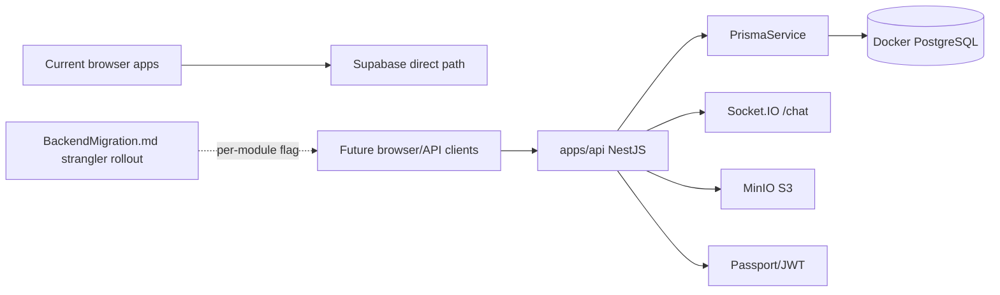

## 19. Operational risks and current limitations

1. **Two backend architectures coexist.** Supabase is current; NestJS/Prisma is incomplete.
2. **Documentation includes future-state language.** `implementationRoomie.md` and `BackendMigration.md` describe intended behavior and milestones; route/source inspection should take precedence.
3. **Connection/payment terminology evolved.** Schema migrations include `PENDING_PAYMENT`, `PENDING_CONNECT`, `PAID`, and `ACTIVE` concepts. Verify the deployed migration state and webhook behavior before changing payment logic.
4. **Some features are partly implemented or phase-based.** Student verification, rate limiting, and parts of push delivery have configuration and UI surfaces but may require deployment secrets and provider setup.
5. **Database authorization is distributed.** Security depends on Supabase RLS, server-side route checks, admin role checks, and correct service-key handling.
6. **Docker PostgreSQL is not automatically the Supabase database.** Running Compose alone does not make the current Next.js app use the container.
7. **The root README is broader than the actual scripts.** It mentions generic package-manager alternatives and `start`/`test` commands that are not root scripts; use each package’s `package.json` as the executable reference.
8. **Third-party availability affects flows.** Paystack, Google OAuth, Supabase Auth, Supabase Storage/Realtime, Web Push, and optional Anthropic receipt parsing all require correctly configured secrets and callbacks.

## 20. Recommended verification before production changes

1. Confirm the deployed Supabase project migration version against `supabase/migrations`.
2. Trace each payment status transition from Paystack initialization through webhook verification and agreement activation.
3. Verify RLS policies for profiles, connections, messages, agreements, housing, storage, reports, and admin data with real authenticated roles.
4. Run `npm run lint`, `npm run check-types`, `npm run build`, and API tests after changes.
5. Decide whether the NestJS migration is active, paused, or to be removed; avoid adding new business logic to both paths.
6. Keep `SUPABASE_SERVICE_ROLE_KEY`, `PAYSTACK_SECRET_KEY`, and VAPID private material server-only.

