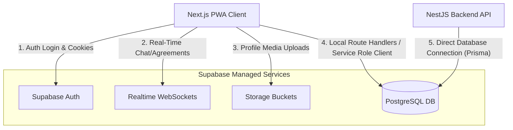

# Roomie System Dependency & Interconnectivity Guide

This document explains the technical architecture, dependencies, and interconnectivity between the different components of the Roomie monorepo, focusing on the roles of **Supabase** and our **NestJS Backend**.

---

## 1. Monorepo Architecture Overview

Roomie is structured as a Turborepo monorepo:

*   **Applications (`apps/`):**
    *   [apps/app](file:///c:/Users/admin/Desktop/Roomie/apps/app): The Next.js Progressive Web App (PWA) client used by students.
    *   [apps/api](file:///c:/Users/admin/Desktop/Roomie/apps/api): The NestJS backend API.
    *   [apps/web](file:///c:/Users/admin/Desktop/Roomie/apps/web): The Next.js public website and landing page.
    *   [apps/admin](file:///c:/Users/admin/Desktop/Roomie/apps/admin): The administrator dashboard.
    *   [apps/docs](file:///c:/Users/admin/Desktop/Roomie/apps/docs): Developer documentation.
*   **Shared Packages (`packages/`):**
    *   [packages/db](file:///c:/Users/admin/Desktop/Roomie/packages/db): Shared database client libraries wrapping Supabase.
    *   [packages/config](file:///c:/Users/admin/Desktop/Roomie/packages/config): Shared configurations (Tailwind CSS, TypeScript, ESLint).
    *   [packages/ui](file:///c:/Users/admin/Desktop/Roomie/packages/ui): Reusable UI components.
    *   [packages/animations](file:///c:/Users/admin/Desktop/Roomie/packages/animations): Shared motion assets and animations.

---

## 2. The Role of Supabase (Authentication & Platform Services)

Supabase controls the client-facing application tier through its managed cloud services (configured locally in [supabase/config.toml](file:///c:/Users/admin/Desktop/Roomie/supabase/config.toml)):

### 2.1 Supabase Services in Action

1.  **Authentication & SSO (`auth.users`):**
    *   Handles student registrations, password management, and Google OAuth SSO.
    *   The client-side session cookie is set via `@supabase/ssr` inside the Next.js middleware / routing layer ([proxy.ts](file:///c:/Users/admin/Desktop/Roomie/apps/app/proxy.ts)).
2.  **Row Level Security (RLS) & Database Layer:**
    *   The database is a PostgreSQL database managed by Supabase.
    *   Supabase migrations ([supabase/migrations](file:///c:/Users/admin/Desktop/Roomie/supabase/migrations)) set Row Level Security (RLS) policies on tables (like `public.profiles`, `public.connections`, and `public.messages`).
    *   RLS guarantees that users can only select or edit records they own (`auth.uid() = id`), or records matching active roommate connections.
3.  **Real-Time Data Streaming:**
    *   Supabase Realtime listens to the PostgreSQL Write-Ahead Log (WAL) and publishes changes over WebSockets.
    *   The Next.js app subscribes directly to channels for chat messages and roommate agreements to update the UI instantly without polling.
4.  **Supabase Storage:**
    *   Stores static assets like user avatars, cover photos, and student ID verification cards.
5.  **Database Triggers (Postgres SQL Functions):**
    *   Database-level logic automatically synchronizes user profiles. When a new user registers in the `auth.users` table, a database trigger automatically runs `handle_new_user()` to populate a row in `public.profiles`.
    *   See implementation in [0001_initial_schema.sql](file:///c:/Users/admin/Desktop/Roomie/supabase/migrations/0001_initial_schema.sql#L312-L330).

---

## 3. Next.js PWA Interconnection

The Next.js PWA ([apps/app](file:///c:/Users/admin/Desktop/Roomie/apps/app)) relies on cookie synchronization to protect routes and request database records:

1.  **Middleware Session Check ([proxy.ts](file:///c:/Users/admin/Desktop/Roomie/apps/app/proxy.ts)):**
    *   Checks the user's cookie storage, validates the token against Supabase Auth, and redirects unauthenticated users to `/auth/signin`.
2.  **Route Protection ([auth-guard.ts](file:///c:/Users/admin/Desktop/Roomie/apps/app/src/lib/auth-guard.ts)):**
    *   Utilizes the `withAuth()` helper to retrieve the authenticated user context inside Next.js server actions and API route handlers.
3.  **Server-Side Database Access:**
    *   Route handlers (like [route.ts](file:///c:/Users/admin/Desktop/Roomie/apps/app/app/api/agreements/route.ts)) run database operations using the Supabase Service Role client (`createServiceClient()` in [@repo/db/server](file:///c:/Users/admin/Desktop/Roomie/packages/db/src/server.ts#L25-L32)).
    *   The service role client bypasses RLS policies to perform administrative tasks (e.g. creating connection records, processing agreement state updates, inserting notifications) after verify-checking the caller's identity via `withAuth()`.

---

## 4. How NestJS Connects with the Database

While the frontend interacts with Supabase APIs and cookie handlers, the NestJS Backend ([apps/api](file:///c:/Users/admin/Desktop/Roomie/apps/api)) connects **directly** to the database:

1.  **Direct Database Connection (Prisma ORM):**
    *   The NestJS backend does not load any `@supabase/supabase-js` libraries or make REST calls to Supabase API endpoints.
    *   Instead, it uses [Prisma Client](file:///c:/Users/admin/Desktop/Roomie/apps/api/src/prisma/prisma.service.ts) to establish a raw PostgreSQL connection using the database connection string (`DATABASE_URL`) from environment variables.
    *   By connecting directly to PostgreSQL, NestJS bypasses RLS checks, operating with full database permissions.
2.  **Shared Database Schema:**
    *   Database schemas are defined in SQL migrations inside the [supabase/migrations](file:///c:/Users/admin/Desktop/Roomie/supabase/migrations) directory.
    *   Prisma synchronizes with this schema through [schema.prisma](file:///c:/Users/admin/Desktop/Roomie/apps/api/prisma/schema.prisma) using standard migrations, ensuring the NestJS TypeScript types map identically to the live Postgres database tables.
3.  **Authentication Bridge (Current State & Migration):**
    *   During the current migration phase, NestJS auth guards ([jwt-auth.guard.ts](file:///c:/Users/admin/Desktop/Roomie/apps/api/src/auth/guards/jwt-auth.guard.ts)) use placeholders that return `true` or mock validations.
    *   As the migration progresses, NestJS will take over validation by verifying JWT tokens issued by Supabase Auth (which are signed using the same JWT secret configured in Supabase), establishing a cryptographic connection without direct network communication between the servers.

---

## 5. Ongoing Migration Context (Strangler Fig Pattern)

As outlined in [BackendMigration.md](file:///c:/Users/admin/Desktop/Roomie/BackendMigration.md), Roomie is actively migrating away from Supabase managed services to self-hosted, containerized equivalents. 

The dependency lines will shift as we transition:

| Feature / Service | Supabase Implementation (Current / Local Dev) | NestJS Backend Replacement (Planned / Underway) |
| :--- | :--- | :--- |
| **Authentication** | Supabase Auth (OAuth / email) + cookie session | Passport.js + custom JWT issuance in NestJS |
| **Database** | Supabase Managed Postgres | Containerized PostgreSQL 16 (Docker Compose) |
| **Real-Time** | Supabase Realtime (WAL WebSockets) | NestJS WebSockets via Socket.io |
| **File Storage** | Supabase Storage Buckets | MinIO (S3-compatible storage in Docker) |
| **Database Triggers**| PL/pgSQL database triggers & triggers functions | NestJS Event Emitters + Prisma Middleware |
| **RLS Policies** | Postgres SQL Policies (auth.uid() matching) | NestJS Guards & Custom Authorization Services |

During this migration, the Next.js PWA uses the environment variable `NEXT_PUBLIC_USE_NEST_API` to swap client routes between Supabase endpoints and NestJS API endpoints module by module.
