# Roomie — Authentication & Onboarding Architecture

> **Scope:** `apps/app` (student-facing Next.js web app)  
> **Stack:** Next.js 14 (App Router) · Supabase Auth · `@supabase/ssr` · SWR · TypeScript  
> **Last updated:** September 2026

---

## Table of Contents

1. [System Architecture Overview](#1-system-architecture-overview)
2. [Authentication Feature](#2-authentication-feature)
   - [2.1 Auth System Architecture Diagram](#21-auth-system-architecture-diagram)
   - [2.2 Email / Password Sign-Up Flow](#22-email--password-sign-up-flow)
   - [2.3 Email / Password Sign-In Flow](#23-email--password-sign-in-flow)
   - [2.4 Google OAuth Flow](#24-google-oauth-flow)
   - [2.5 Password Reset Flow](#25-password-reset-flow)
   - [2.6 Session Persistence & Hydration](#26-session-persistence--hydration)
   - [2.7 Auth Use Cases](#27-auth-use-cases)
3. [Onboarding Feature](#3-onboarding-feature)
   - [3.1 Onboarding Architecture Diagram](#31-onboarding-architecture-diagram)
   - [3.2 Step-by-Step Onboarding Flow](#32-step-by-step-onboarding-flow)
   - [3.3 Onboarding Resume Logic](#33-onboarding-resume-logic)
   - [3.4 Student ID Verification Flow](#34-student-id-verification-flow)
   - [3.5 Onboarding Use Cases](#35-onboarding-use-cases)
4. [Account Lifecycle & Access Control](#4-account-lifecycle--access-control)
   - [4.1 Account State Machine](#41-account-state-machine)
   - [4.2 Barred Account & Appeal Flow](#42-barred-account--appeal-flow)
   - [4.3 Access Control Use Cases](#43-access-control-use-cases)
5. [Database Schema — Auth & Profile Tables](#5-database-schema--auth--profile-tables)
6. [Component Relationship Map](#6-component-relationship-map)
7. [Validation Architecture](#7-validation-architecture)
8. [Key Design Decisions & Notes](#8-key-design-decisions--notes)

---

## 1. System Architecture Overview

Roomie's app is a **Next.js 14 App Router** application hosted on Vercel, using **Supabase** as the full backend — authentication, database, real-time subscriptions, and file storage.

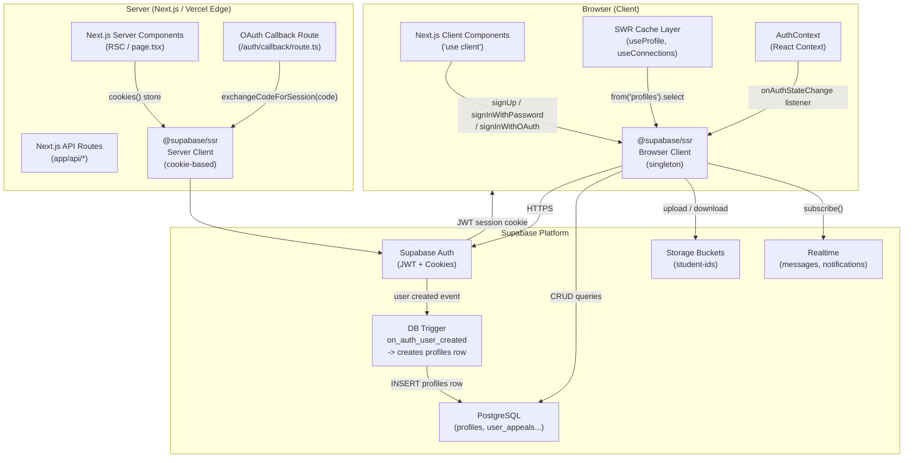
```mermaid
graph TB
    subgraph Browser["Browser (Client)"]
        NextClient["Next.js Client Components\n('use client')"]
        SWR["SWR Cache Layer\n(useProfile, useConnections)"]
        SupabaseClient["@supabase/ssr\nBrowser Client\n(singleton)"]
        AuthCtx["AuthContext\n(React Context)"]
    end

    subgraph Server["Server (Next.js / Vercel Edge)"]
        NextServer["Next.js Server Components\n(RSC / page.tsx)"]
        APIRoutes["Next.js API Routes\n(app/api/*)"]
        CallbackRoute["OAuth Callback Route\n(/auth/callback/route.ts)"]
        SupabaseServer["@supabase/ssr\nServer Client\n(cookie-based)"]
    end

    subgraph Supabase["Supabase Platform"]
        SupaAuth["Supabase Auth\n(JWT + Cookies)"]
        SupaDB["PostgreSQL\n(profiles, user_appeals...)"]
        SupaStorage["Storage Buckets\n(student-ids)"]
        SupaRealtime["Realtime\n(messages, notifications)"]
        DBTrigger["DB Trigger\non_auth_user_created\n-> creates profiles row"]
    end

    NextClient -->|"signUp / signInWithPassword\n/ signInWithOAuth"| SupabaseClient
    SupabaseClient -->|HTTPS| SupaAuth
    AuthCtx -->|"onAuthStateChange listener"| SupabaseClient
    SWR -->|"from('profiles').select"| SupabaseClient

    NextServer -->|"cookies() store"| SupabaseServer
    CallbackRoute -->|"exchangeCodeForSession(code)"| SupabaseServer
    SupabaseServer --> SupaAuth

    SupaAuth -->|"JWT session cookie"| Browser
    SupaAuth -->|"user created event"| DBTrigger
    DBTrigger -->|"INSERT profiles row"| SupaDB
    SupabaseClient -->|"CRUD queries"| SupaDB
    SupabaseClient -->|"upload / download"| SupaStorage
    SupabaseClient -->|"subscribe()"| SupaRealtime
```

### How the session model works

Supabase Auth uses **cookie-based JWT sessions** managed by `@supabase/ssr`:

- On sign-in, Supabase sets an `sb-*` HTTP-only cookie in the browser.
- Server Components and API routes read this cookie via `cookies()` from `next/headers`, building a server Supabase client that can validate the session without a client round-trip.
- The `AuthContext` client-side maintains a reactive `user` state by subscribing to `supabase.auth.onAuthStateChange`, which fires synchronously from the existing cookie on mount — no extra network request needed.

---

## 2. Authentication Feature

### 2.1 Auth System Architecture Diagram

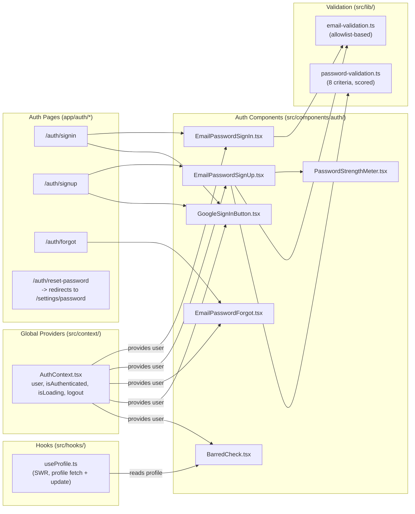
```mermaid
graph LR
    subgraph Pages["Auth Pages (app/auth/*)"]
        SignIn["/auth/signin"]
        SignUp["/auth/signup"]
        Forgot["/auth/forgot"]
        ResetPwd["/auth/reset-password\n-> redirects to /settings/password"]
    end

    subgraph Components["Auth Components (src/components/auth/)"]
        EPS["EmailPasswordSignIn.tsx"]
        EPU["EmailPasswordSignUp.tsx"]
        EPF["EmailPasswordForgot.tsx"]
        Google["GoogleSignInButton.tsx"]
        Strength["PasswordStrengthMeter.tsx"]
        Barred["BarredCheck.tsx"]
    end

    subgraph Validation["Validation (src/lib/)"]
        EmailVal["email-validation.ts\n(allowlist-based)"]
        PwdVal["password-validation.ts\n(8 criteria, scored)"]
    end

    subgraph Context["Global Providers (src/context/)"]
        AuthCtx["AuthContext.tsx\nuser, isAuthenticated, isLoading, logout"]
    end

    subgraph Hooks["Hooks (src/hooks/)"]
        UseProfile["useProfile.ts\n(SWR, profile fetch + update)"]
    end

    SignIn --> EPS & Google
    SignUp --> EPU & Google
    Forgot --> EPF
    EPU --> Strength & EmailVal & PwdVal
    EPS --> EmailVal
    AuthCtx -->|provides user| EPS & EPU & EPF & Google & Barred
    UseProfile -->|reads profile| Barred
```

### 2.2 Email / Password Sign-Up Flow

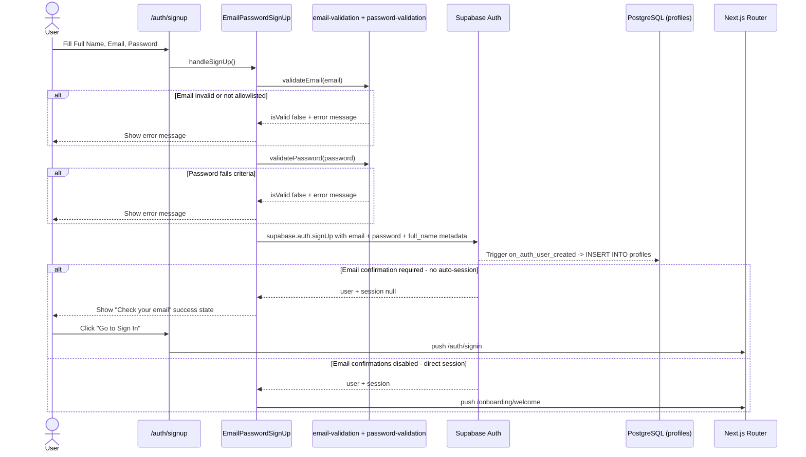
```mermaid
sequenceDiagram
    actor User
    participant SignUpPage as /auth/signup
    participant EPU as EmailPasswordSignUp
    participant Validation as email-validation + password-validation
    participant SupaAuth as Supabase Auth
    participant DB as PostgreSQL (profiles)
    participant Router as Next.js Router

    User->>SignUpPage: Fill Full Name, Email, Password
    SignUpPage->>EPU: handleSignUp()

    EPU->>Validation: validateEmail(email)
    alt Email invalid or not allowlisted
        Validation-->>EPU: isValid false + error message
        EPU-->>User: Show error message
    end

    EPU->>Validation: validatePassword(password)
    alt Password fails criteria
        Validation-->>EPU: isValid false + error message
        EPU-->>User: Show error message
    end

    EPU->>SupaAuth: supabase.auth.signUp with email + password + full_name metadata
    SupaAuth-->>DB: Trigger on_auth_user_created -> INSERT INTO profiles

    alt Email confirmation required - no auto-session
        SupaAuth-->>EPU: user + session null
        EPU-->>User: Show "Check your email" success state
        User->>SignUpPage: Click "Go to Sign In"
        SignUpPage->>Router: push /auth/signin
    else Email confirmations disabled - direct session
        SupaAuth-->>EPU: user + session
        EPU->>Router: push /onboarding/welcome
    end
```

**Key notes:**
- Email validation uses an **allowlist** of known providers (Gmail, Outlook, iCloud, Proton, etc.) — temporary or disposable email providers are rejected.
- Password validation scores on 8 criteria (length, case mix, numbers, special chars, no repeats, unique chars, no sequences, no common words). A score of 5/5 = **strong**; partial = **medium** or **weak**.
- The `full_name` is stored in Supabase Auth's `user_metadata` and later seeded into the `profiles.display_name` by the DB trigger.

### 2.3 Email / Password Sign-In Flow

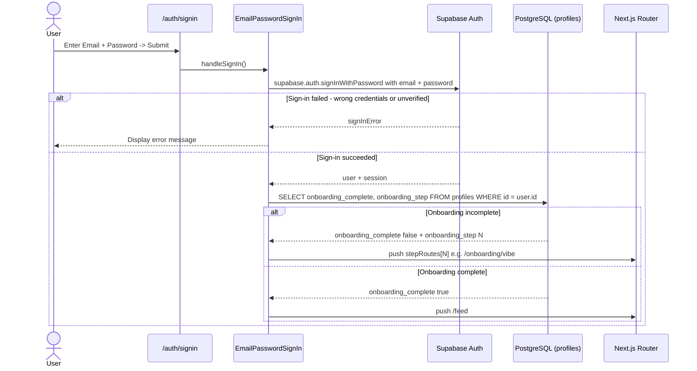
```mermaid
sequenceDiagram
    actor User
    participant SignInPage as /auth/signin
    participant EPS as EmailPasswordSignIn
    participant SupaAuth as Supabase Auth
    participant DB as PostgreSQL (profiles)
    participant Router as Next.js Router

    User->>SignInPage: Enter Email + Password -> Submit
    SignInPage->>EPS: handleSignIn()

    EPS->>SupaAuth: supabase.auth.signInWithPassword with email + password

    alt Sign-in failed - wrong credentials or unverified
        SupaAuth-->>EPS: signInError
        EPS-->>User: Display error message
    else Sign-in succeeded
        SupaAuth-->>EPS: user + session
        EPS->>DB: SELECT onboarding_complete, onboarding_step FROM profiles WHERE id = user.id

        alt Onboarding incomplete
            DB-->>EPS: onboarding_complete false + onboarding_step N
            EPS->>Router: push stepRoutes[N] e.g. /onboarding/vibe
        else Onboarding complete
            DB-->>EPS: onboarding_complete true
            EPS->>Router: push /feed
        end
    end
```

**Step routing map on sign-in:**

| `onboarding_step` | Redirect destination |
|:-:|:-|
| 0 | `/onboarding/welcome` |
| 1 | `/onboarding/basics` |
| 2 | `/onboarding/university` |
| 3 | `/onboarding/vibe` |
| 4 | `/onboarding/budget` |
| 5 | `/onboarding/verify` |
| 6+ (complete) | `/feed` |

### 2.4 Google OAuth Flow

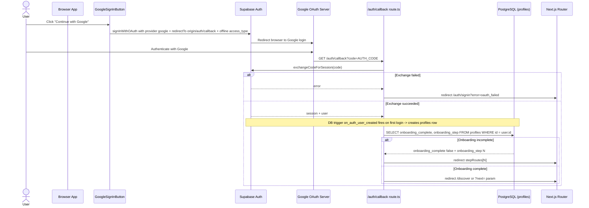
```mermaid
sequenceDiagram
    actor User
    participant App as Browser App
    participant Google as GoogleSignInButton
    participant SupaAuth as Supabase Auth
    participant GoogleOAuth as Google OAuth Server
    participant Callback as /auth/callback route.ts
    participant DB as PostgreSQL (profiles)
    participant Router as Next.js Router

    User->>Google: Click "Continue with Google"
    Google->>SupaAuth: signInWithOAuth with provider google + redirectTo origin/auth/callback + offline access_type
    SupaAuth->>GoogleOAuth: Redirect browser to Google login
    User->>GoogleOAuth: Authenticate with Google
    GoogleOAuth->>Callback: GET /auth/callback?code=AUTH_CODE

    Callback->>SupaAuth: exchangeCodeForSession(code)
    alt Exchange failed
        SupaAuth-->>Callback: error
        Callback->>Router: redirect /auth/signin?error=oauth_failed
    else Exchange succeeded
        SupaAuth-->>Callback: session + user
        Note over SupaAuth,DB: DB trigger on_auth_user_created fires on first login -> creates profiles row
        Callback->>DB: SELECT onboarding_complete, onboarding_step FROM profiles WHERE id = user.id

        alt Onboarding incomplete
            DB-->>Callback: onboarding_complete false + onboarding_step N
            Callback->>Router: redirect stepRoutes[N]
        else Onboarding complete
            Callback->>Router: redirect /discover or ?next= param
        end
    end
```

**Key notes:**
- `access_type: 'offline'` and `prompt: 'consent'` force Google to issue a refresh token every time, ensuring long-lived sessions.
- The callback route is a **Next.js Route Handler** (`route.ts`) running on the server, allowing it to use the `cookies()` API to set the session cookie securely before redirecting.
- For Google OAuth users, the `on_auth_user_created` trigger fires on their *first* login and auto-creates a `profiles` row.

### 2.5 Password Reset Flow

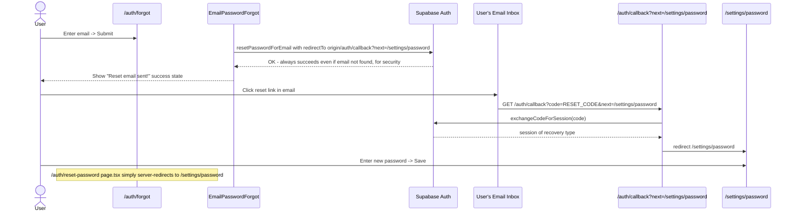
```mermaid
sequenceDiagram
    actor User
    participant ForgotPage as /auth/forgot
    participant EPF as EmailPasswordForgot
    participant SupaAuth as Supabase Auth
    participant Email as User's Email Inbox
    participant Callback as /auth/callback?next=/settings/password
    participant SettingsPage as /settings/password

    User->>ForgotPage: Enter email -> Submit
    EPF->>SupaAuth: resetPasswordForEmail with redirectTo origin/auth/callback?next=/settings/password
    SupaAuth-->>EPF: OK - always succeeds even if email not found, for security
    EPF-->>User: Show "Reset email sent!" success state

    User->>Email: Click reset link in email
    Email->>Callback: GET /auth/callback?code=RESET_CODE&next=/settings/password
    Callback->>SupaAuth: exchangeCodeForSession(code)
    SupaAuth-->>Callback: session of recovery type
    Callback->>SettingsPage: redirect /settings/password
    User->>SettingsPage: Enter new password -> Save

    Note over ForgotPage: /auth/reset-password page.tsx simply server-redirects to /settings/password
```

### 2.6 Session Persistence & Hydration

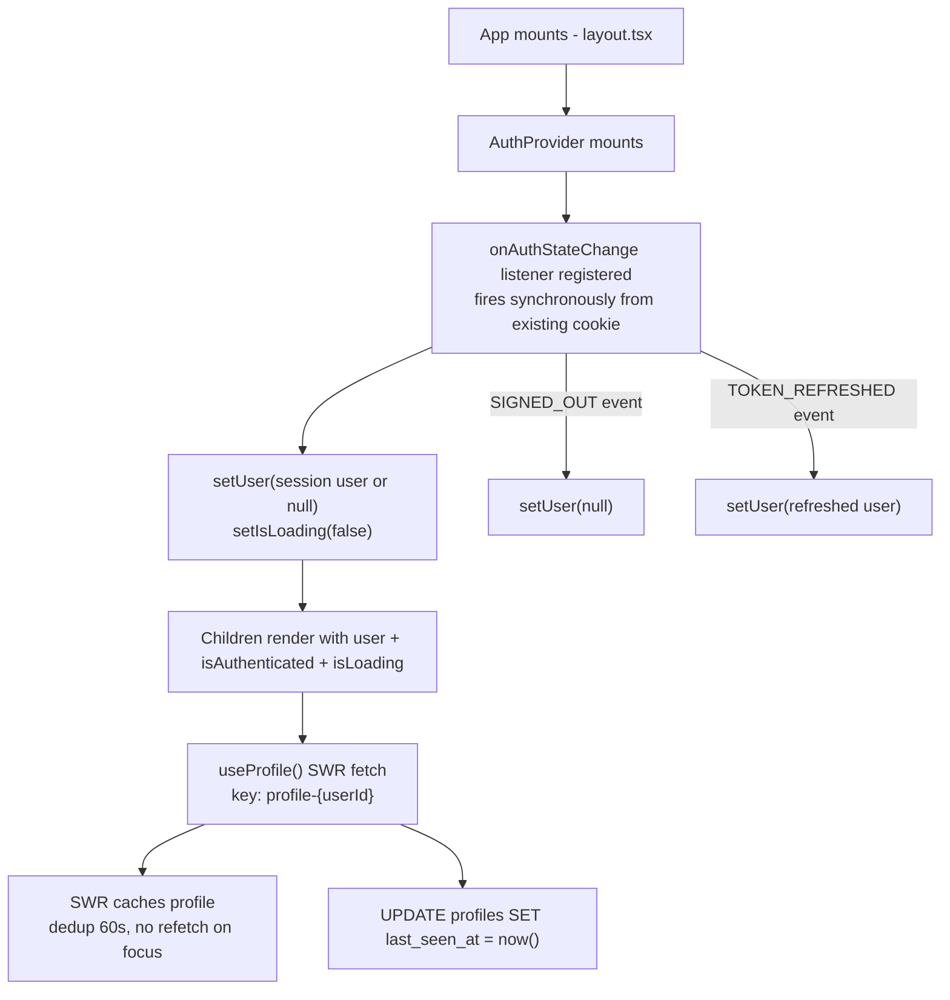
```mermaid
graph TD
    AppMount["App mounts - layout.tsx"]
    AuthProvider["AuthProvider mounts"]
    OACListener["onAuthStateChange listener registered\nfires synchronously from existing cookie"]
    SetUser["setUser(session user or null)\nsetIsLoading(false)"]
    ChildrenRender["Children render with user + isAuthenticated + isLoading"]
    ProfileFetch["useProfile() SWR fetch\nkey: profile-{userId}"]
    ProfileCache["SWR caches profile\ndedup 60s, no refetch on focus"]
    LastSeen["UPDATE profiles SET last_seen_at = now()"]

    AppMount --> AuthProvider
    AuthProvider --> OACListener
    OACListener --> SetUser
    SetUser --> ChildrenRender
    ChildrenRender --> ProfileFetch
    ProfileFetch --> ProfileCache
    ProfileFetch --> LastSeen

    OACListener -->|"SIGNED_OUT event"| SetUser2["setUser(null)"]
    OACListener -->|"TOKEN_REFRESHED event"| SetUser3["setUser(refreshed user)"]
```

**Key behaviour:**
- `isLoading` starts `true` and becomes `false` only after `onAuthStateChange` fires — preventing flash of unauthenticated UI.
- The Supabase browser client is a **singleton** (`_client` module-level variable in `client.ts`) — stable across re-renders and hot reloads.
- `useProfile` uses `useSWR` with a `user`-keyed cache key (`profile-{userId}`), so the profile is only fetched when a user is present and auto-regenerates a unique username if missing.

### 2.7 Auth Use Cases

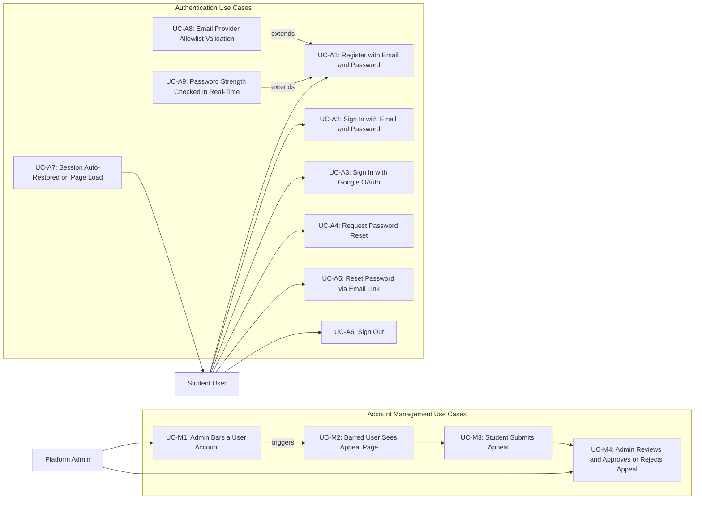
```mermaid
graph LR
    Actor_Student["Student User"]
    Actor_Admin["Platform Admin"]

    subgraph UC_Auth["Authentication Use Cases"]
        UC1["UC-A1: Register with Email and Password"]
        UC2["UC-A2: Sign In with Email and Password"]
        UC3["UC-A3: Sign In with Google OAuth"]
        UC4["UC-A4: Request Password Reset"]
        UC5["UC-A5: Reset Password via Email Link"]
        UC6["UC-A6: Sign Out"]
        UC7["UC-A7: Session Auto-Restored on Page Load"]
        UC8["UC-A8: Email Provider Allowlist Validation"]
        UC9["UC-A9: Password Strength Checked in Real-Time"]
    end

    subgraph UC_Mgmt["Account Management Use Cases"]
        UC10["UC-M1: Admin Bars a User Account"]
        UC11["UC-M2: Barred User Sees Appeal Page"]
        UC12["UC-M3: Student Submits Appeal"]
        UC13["UC-M4: Admin Reviews and Approves or Rejects Appeal"]
    end

    Actor_Student --> UC1 & UC2 & UC3 & UC4 & UC5 & UC6
    UC7 --> Actor_Student
    UC8 -->|extends| UC1
    UC9 -->|extends| UC1
    Actor_Admin --> UC10 & UC13
    UC10 -->|triggers| UC11
    UC11 --> UC12
    UC12 --> UC13
```

---

## 3. Onboarding Feature

### 3.1 Onboarding Architecture Diagram

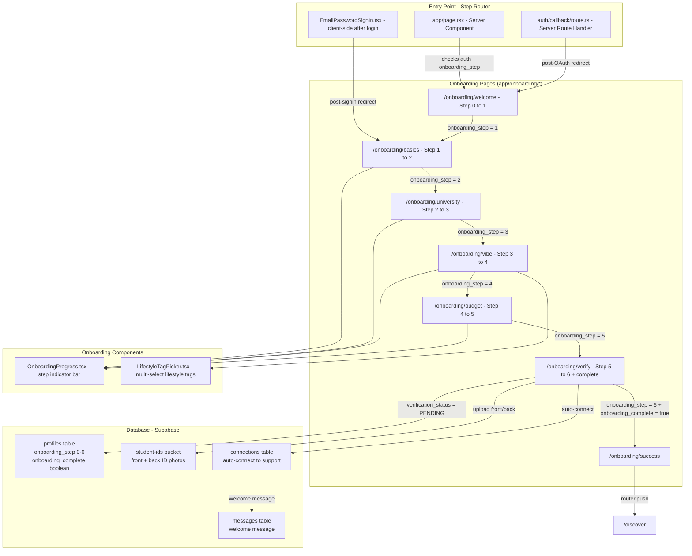
```mermaid
graph TB
    subgraph OnboardingPages["Onboarding Pages (app/onboarding/*)"]
        Welcome["/onboarding/welcome - Step 0 to 1"]
        Basics["/onboarding/basics - Step 1 to 2"]
        University["/onboarding/university - Step 2 to 3"]
        Vibe["/onboarding/vibe - Step 3 to 4"]
        Budget["/onboarding/budget - Step 4 to 5"]
        Verify["/onboarding/verify - Step 5 to 6 + complete"]
        Success["/onboarding/success"]
    end

    subgraph Components["Onboarding Components"]
        Progress["OnboardingProgress.tsx - step indicator bar"]
        TagPicker["LifestyleTagPicker.tsx - multi-select lifestyle tags"]
    end

    subgraph EntryPoints["Entry Point - Step Router"]
        RootPage["app/page.tsx - Server Component"]
        CallbackRoute["auth/callback/route.ts - Server Route Handler"]
        SignInLogic["EmailPasswordSignIn.tsx - client-side after login"]
    end

    subgraph DBLayer["Database - Supabase"]
        ProfilesTable["profiles table\nonboarding_step 0-6\nonboarding_complete boolean"]
        StorageBucket["student-ids bucket\nfront + back ID photos"]
        Connections["connections table\nauto-connect to support"]
        Messages["messages table\nwelcome message"]
    end

    RootPage -->|"checks auth + onboarding_step"| Welcome
    CallbackRoute -->|"post-OAuth redirect"| Welcome
    SignInLogic -->|"post-signin redirect"| Basics

    Welcome -->|"onboarding_step = 1"| Basics
    Basics -->|"onboarding_step = 2"| University
    University -->|"onboarding_step = 3"| Vibe
    Vibe -->|"onboarding_step = 4"| Budget
    Budget -->|"onboarding_step = 5"| Verify
    Verify -->|"onboarding_step = 6 + onboarding_complete = true"| Success
    Success -->|"router.push"| Discover["/discover"]

    Basics --> Progress
    University --> Progress
    Vibe --> Progress & TagPicker
    Budget --> Progress

    Verify -->|"upload front/back"| StorageBucket
    Verify -->|"verification_status = PENDING"| ProfilesTable
    Verify -->|"auto-connect"| Connections
    Connections -->|"welcome message"| Messages
```

### 3.2 Step-by-Step Onboarding Flow

```mermaid
flowchart TD
    Start([User authenticated but onboarding not complete])

    W["STEP 0 -> 1: /onboarding/welcome\n────────────────────────\nGreets user by first name\nShows Sparkles animation placeholder\nLets go button\n────────────────────────\nSaves: onboarding_step = 1"]

    B["STEP 1 -> 2: /onboarding/basics\n────────────────────────\nDisplay name\nBirthday - auto-calculates age\nGender: Male or Female\nCity - dropdown + custom option\nShort bio - optional\n────────────────────────\nSaves: display_name, birthday, age, gender, city, bio, onboarding_step = 2"]

    U["STEP 2 -> 3: /onboarding/university\n────────────────────────\nUniversity - city-filtered or full list\nCustom school name + state if Other\nYear of study: 100L to Final Year\nFaculty - optional, preset + custom\nCourse - optional, preset + custom\n────────────────────────\nSaves: university, state, year_of_study, faculty, course, onboarding_step = 3"]

    V["STEP 3 -> 4: /onboarding/vibe\n────────────────────────\nSleep schedule: Early Bird, Night Owl, Flexible\nCleanliness: Very Tidy to Messy\nNoise preference: Very Quiet to Lively\nAllows smoking - toggle\nAllows pets - toggle\nAllows guests - toggle, default ON\nLifestyle tags - multi-select\n────────────────────────\nSaves: sleep_schedule, cleanliness, noise_pref, allows_smoking, allows_pets, allows_guests, lifestyle_tags, onboarding_step = 4"]

    BG["STEP 4 -> 5: /onboarding/budget\n────────────────────────\nMonthly budget range - N20K to N500K sliders\nMove-in date - optional\nPreferred roommate gender: Any, Male, Female\n────────────────────────\nSaves: min_budget, max_budget, move_in_date, roommate_gender_pref, onboarding_step = 5"]

    VR["STEP 5 -> 6: /onboarding/verify\n────────────────────────\nUpload student ID front - image or PDF, max 5MB\nUpload student ID back - image or PDF, max 5MB\nIf both uploaded: Submit for verification button\nIf skipped: Mark complete without ID\n────────────────────────\nOn submit: verification_status = PENDING, onboarding_complete = true, onboarding_step = 6\nOn skip: onboarding_complete = true, onboarding_step = 6\nBoth paths: auto-connect to official support account + send welcome message"]

    S["SUCCESS: /onboarding/success\n────────────────────────\nAnimated ShieldCheck icon with pulsing ring\nSupport connection notice\nGet Started button -> /discover"]

    Start --> W --> B --> U --> V --> BG --> VR --> S
```

### 3.3 Onboarding Resume Logic

The system tracks progress using `onboarding_step` (0–6) in the `profiles` table. Users can close the app mid-onboarding and resume exactly where they left off.

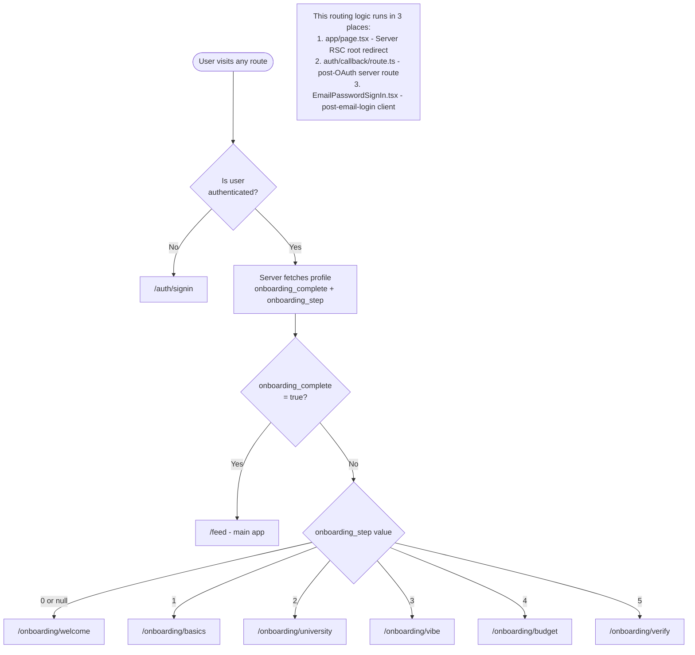
```mermaid
flowchart TD
    Start(["User visits any route"]) --> Check{"Is user\nauthenticated?"}
    Check -->|No| SignIn["/auth/signin"]
    Check -->|Yes| FetchProfile["Server fetches profile\nonboarding_complete + onboarding_step"]

    FetchProfile --> Complete{"onboarding_complete\n= true?"}
    Complete -->|Yes| Feed["/feed - main app"]
    Complete -->|No| StepRoute{"onboarding_step value"}

    StepRoute -->|0 or null| W["/onboarding/welcome"]
    StepRoute -->|1| B["/onboarding/basics"]
    StepRoute -->|2| U["/onboarding/university"]
    StepRoute -->|3| V["/onboarding/vibe"]
    StepRoute -->|4| BG["/onboarding/budget"]
    StepRoute -->|5| VR["/onboarding/verify"]

    Note["This routing logic runs in 3 places:\n1. app/page.tsx - Server RSC root redirect\n2. auth/callback/route.ts - post-OAuth server route\n3. EmailPasswordSignIn.tsx - post-email-login client"]
```

### 3.4 Student ID Verification Flow

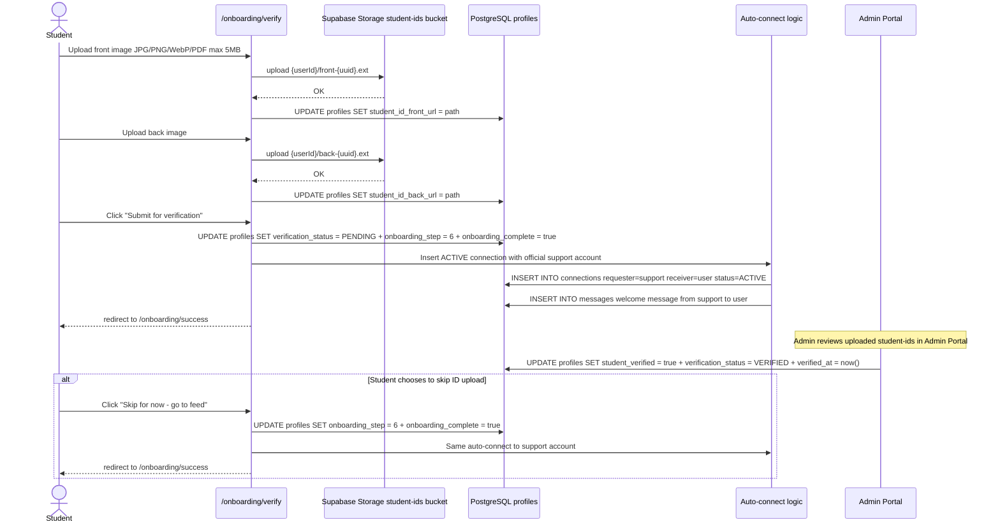
```mermaid
sequenceDiagram
    actor Student
    participant VerifyPage as /onboarding/verify
    participant Storage as Supabase Storage student-ids bucket
    participant DB as PostgreSQL profiles
    participant AutoConnect as Auto-connect logic
    participant AdminPortal as Admin Portal

    Student->>VerifyPage: Upload front image JPG/PNG/WebP/PDF max 5MB
    VerifyPage->>Storage: upload {userId}/front-{uuid}.ext
    Storage-->>VerifyPage: OK
    VerifyPage->>DB: UPDATE profiles SET student_id_front_url = path

    Student->>VerifyPage: Upload back image
    VerifyPage->>Storage: upload {userId}/back-{uuid}.ext
    Storage-->>VerifyPage: OK
    VerifyPage->>DB: UPDATE profiles SET student_id_back_url = path

    Student->>VerifyPage: Click "Submit for verification"
    VerifyPage->>DB: UPDATE profiles SET verification_status = PENDING + onboarding_step = 6 + onboarding_complete = true
    VerifyPage->>AutoConnect: Insert ACTIVE connection with official support account
    AutoConnect->>DB: INSERT INTO connections requester=support receiver=user status=ACTIVE
    AutoConnect->>DB: INSERT INTO messages welcome message from support to user
    VerifyPage-->>Student: redirect to /onboarding/success

    Note over AdminPortal: Admin reviews uploaded student-ids in Admin Portal
    AdminPortal->>DB: UPDATE profiles SET student_verified = true + verification_status = VERIFIED + verified_at = now()

    alt Student chooses to skip ID upload
        Student->>VerifyPage: Click "Skip for now - go to feed"
        VerifyPage->>DB: UPDATE profiles SET onboarding_step = 6 + onboarding_complete = true
        VerifyPage->>AutoConnect: Same auto-connect to support account
        VerifyPage-->>Student: redirect to /onboarding/success
    end
```

### 3.5 Onboarding Use Cases

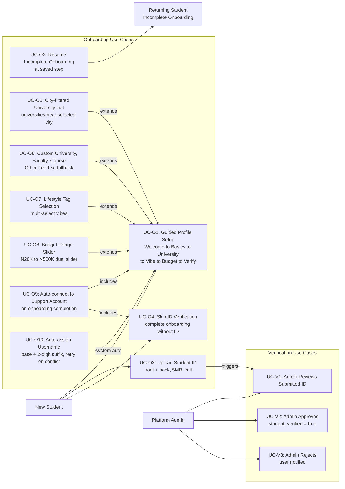
```mermaid
graph LR
    Actor_New["New Student"]
    Actor_Returning["Returning Student\nIncomplete Onboarding"]
    Actor_Admin["Platform Admin"]

    subgraph UC_Onboard["Onboarding Use Cases"]
        UC1["UC-O1: Guided Profile Setup\nWelcome to Basics to University\nto Vibe to Budget to Verify"]
        UC2["UC-O2: Resume Incomplete Onboarding\nat saved step"]
        UC3["UC-O3: Upload Student ID\nfront + back, 5MB limit"]
        UC4["UC-O4: Skip ID Verification\ncomplete onboarding without ID"]
        UC5["UC-O5: City-filtered University List\nuniversities near selected city"]
        UC6["UC-O6: Custom University, Faculty, Course\nOther free-text fallback"]
        UC7["UC-O7: Lifestyle Tag Selection\nmulti-select vibes"]
        UC8["UC-O8: Budget Range Slider\nN20K to N500K dual slider"]
        UC9["UC-O9: Auto-connect to Support Account\non onboarding completion"]
        UC10["UC-O10: Auto-assign Username\nbase + 2-digit suffix, retry on conflict"]
    end

    subgraph UC_Verify["Verification Use Cases"]
        UV1["UC-V1: Admin Reviews Submitted ID"]
        UV2["UC-V2: Admin Approves\nstudent_verified = true"]
        UV3["UC-V3: Admin Rejects\nuser notified"]
    end

    Actor_New --> UC1 & UC3 & UC4
    UC2 --> Actor_Returning
    UC5 -->|extends| UC1
    UC6 -->|extends| UC1
    UC7 -->|extends| UC1
    UC8 -->|extends| UC1
    UC9 -->|includes| UC1 & UC4
    UC10 -->|system auto| UC1
    Actor_Admin --> UV1 & UV2 & UV3
    UC3 -->|triggers| UV1
```

---

## 4. Account Lifecycle & Access Control

### 4.1 Account State Machine

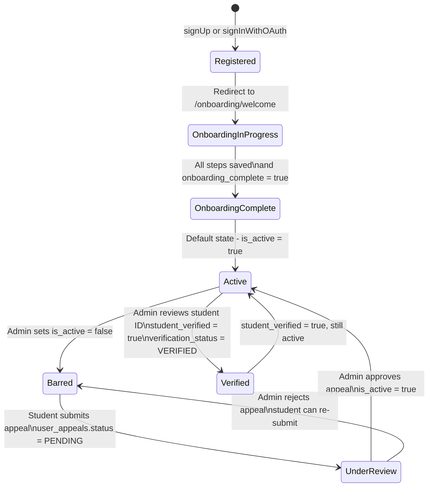
```mermaid
stateDiagram-v2
    [*] --> Registered : signUp or signInWithOAuth

    Registered --> OnboardingInProgress : Redirect to /onboarding/welcome

    OnboardingInProgress --> OnboardingComplete : All steps saved\nand onboarding_complete = true

    OnboardingComplete --> Active : Default state - is_active = true

    Active --> Barred : Admin sets is_active = false

    Barred --> UnderReview : Student submits appeal\nuser_appeals.status = PENDING

    UnderReview --> Active : Admin approves appeal\nis_active = true

    UnderReview --> Barred : Admin rejects appeal\nstudent can re-submit

    Active --> Verified : Admin reviews student ID\nstudent_verified = true\nverification_status = VERIFIED

    Verified --> Active : student_verified = true, still active
```

> **Barred state behaviour:** `BarredCheck.tsx` wraps all children in the root layout. When `profile.is_active === false`, all pages except `/appeal` and `/auth/*` are blocked and the user is redirected to `/appeal`. The barred check renders a spinner while loading to avoid UI flicker.

### 4.2 Barred Account & Appeal Flow

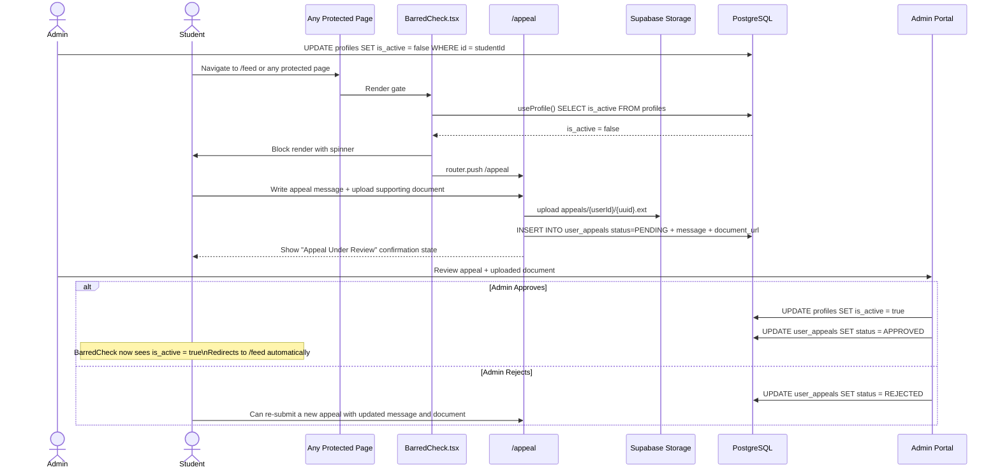
```mermaid
sequenceDiagram
    actor Admin
    actor Student
    participant AppAccess as Any Protected Page
    participant BarredCheck as BarredCheck.tsx
    participant AppealPage as /appeal
    participant Storage as Supabase Storage
    participant DB as PostgreSQL
    participant AdminPortal as Admin Portal

    Admin->>DB: UPDATE profiles SET is_active = false WHERE id = studentId

    Student->>AppAccess: Navigate to /feed or any protected page
    AppAccess->>BarredCheck: Render gate
    BarredCheck->>DB: useProfile() SELECT is_active FROM profiles
    DB-->>BarredCheck: is_active = false
    BarredCheck->>Student: Block render with spinner
    BarredCheck->>AppealPage: router.push /appeal

    Student->>AppealPage: Write appeal message + upload supporting document
    AppealPage->>Storage: upload appeals/{userId}/{uuid}.ext
    AppealPage->>DB: INSERT INTO user_appeals status=PENDING + message + document_url

    AppealPage-->>Student: Show "Appeal Under Review" confirmation state

    Admin->>AdminPortal: Review appeal + uploaded document

    alt Admin Approves
        AdminPortal->>DB: UPDATE profiles SET is_active = true
        AdminPortal->>DB: UPDATE user_appeals SET status = APPROVED
        Note over Student: BarredCheck now sees is_active = true\nRedirects to /feed automatically
    else Admin Rejects
        AdminPortal->>DB: UPDATE user_appeals SET status = REJECTED
        Student->>AppealPage: Can re-submit a new appeal with updated message and document
    end
```

### 4.3 Access Control Use Cases

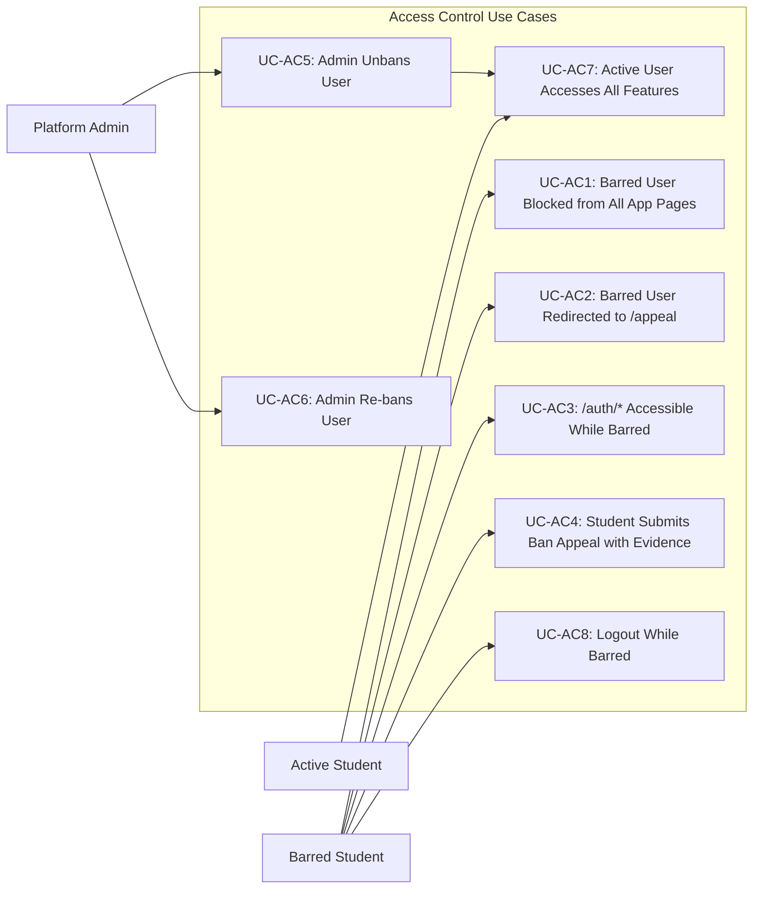
```mermaid
graph LR
    Actor_Active["Active Student"]
    Actor_Barred["Barred Student"]
    Actor_Admin["Platform Admin"]

    subgraph UC_Access["Access Control Use Cases"]
        UC1["UC-AC1: Barred User Blocked from All App Pages"]
        UC2["UC-AC2: Barred User Redirected to /appeal"]
        UC3["UC-AC3: /auth/* Accessible While Barred"]
        UC4["UC-AC4: Student Submits Ban Appeal with Evidence"]
        UC5["UC-AC5: Admin Unbans User"]
        UC6["UC-AC6: Admin Re-bans User"]
        UC7["UC-AC7: Active User Accesses All Features"]
        UC8["UC-AC8: Logout While Barred"]
    end

    Actor_Barred --> UC1 & UC2 & UC3 & UC4 & UC8
    Actor_Admin --> UC5 & UC6
    UC5 --> UC7
    Actor_Active --> UC7
```

---

## 5. Database Schema — Auth & Profile Tables

### `profiles` table (auth-related fields)

The `profiles` table is the central user entity. It is auto-created by the `on_auth_user_created` DB trigger when Supabase Auth creates a new user.

| Column | Type | Description |
|--------|------|-------------|
| `id` | `uuid` | **PK** — mirrors `auth.users.id` |
| `display_name` | `text` | Set from `user_metadata.full_name` on creation |
| `username` | `text\|null` | Auto-generated slug (e.g. `john42`), unique |
| `onboarding_step` | `int\|null` | 0–6, tracks progress through wizard |
| `onboarding_complete` | `bool\|null` | `true` once verify step is saved |
| `is_active` | `bool\|null` | `true` by default; `false` = barred |
| `is_barred` | `bool\|null` | Redundant barred flag (secondary) |
| `verification_status` | `enum\|null` | `NONE \| PENDING \| VERIFIED \| REJECTED` |
| `student_verified` | `bool\|null` | `true` after admin approval |
| `student_id_front_url` | `text\|null` | Storage path for front of student ID |
| `student_id_back_url` | `text\|null` | Storage path for back of student ID |
| `verified_at` | `timestamptz\|null` | When admin approved verification |
| `last_seen_at` | `timestamptz\|null` | Updated once per session mount |
| `created_at` | `timestamptz\|null` | Row creation timestamp |
| `updated_at` | `timestamptz\|null` | Last mutation timestamp |

**Lifestyle / preference fields collected during onboarding:**

| Column | Type | Onboarding Step |
|--------|------|:-:|
| `gender` | `enum (male\|female)` | Basics (1) |
| `birthday` | `date` | Basics (1) |
| `age` | `int` | Basics (1) — computed |
| `city` | `text` | Basics (1) |
| `bio` | `text` | Basics (1) |
| `university` | `text` | University (2) |
| `state` | `text` | University (2) |
| `year_of_study` | `int` | University (2) |
| `faculty` | `text` | University (2) |
| `course` | `text` | University (2) |
| `sleep_schedule` | `enum` | Vibe (3) |
| `cleanliness` | `enum` | Vibe (3) |
| `noise_pref` | `enum` | Vibe (3) |
| `allows_smoking` | `bool` | Vibe (3) |
| `allows_pets` | `bool` | Vibe (3) |
| `allows_guests` | `bool` | Vibe (3) |
| `lifestyle_tags` | `text[]` | Vibe (3) |
| `min_budget` | `int` | Budget (4) |
| `max_budget` | `int` | Budget (4) |
| `move_in_date` | `date` | Budget (4) |
| `roommate_gender_pref` | `enum` | Budget (4) |

### `user_appeals` table

| Column | Type | Description |
|--------|------|-------------|
| `id` | `uuid` | PK |
| `user_id` | `uuid` | FK → `profiles.id` |
| `status` | `enum` | `PENDING \| APPROVED \| REJECTED` |
| `message` | `text\|null` | Student's written explanation |
| `document_url` | `text` | Storage path of uploaded evidence |
| `created_at` | `timestamptz` | Submission timestamp |

### `connections` table (auto-created at onboarding completion)

| Column | Type | Description |
|--------|------|-------------|
| `id` | `uuid` | PK |
| `requester_id` | `uuid` | FK → `profiles.id` |
| `receiver_id` | `uuid` | FK → `profiles.id` |
| `status` | `enum` | `PENDING \| ACTIVE \| DECLINED \| EXPIRED` |
| `connected_at` | `timestamptz\|null` | When connection became ACTIVE |

---

## 6. Component Relationship Map

```mermaid
graph TB
    subgraph RootLayout["RootLayout - app/layout.tsx"]
        ThemeProvider["ThemeProvider"]
        AuthProvider["AuthProvider"]
        NotificationProvider["NotificationProvider"]
        BarredCheck["BarredCheck"]
        ServiceWorkerRegister["ServiceWorkerRegister"]
    end

    subgraph AuthFlow["Auth Pages and Components"]
        SignInPage["app/auth/signin/page.tsx"]
        SignUpPage["app/auth/signup/page.tsx"]
        ForgotPage["app/auth/forgot/page.tsx"]
        CallbackRoute["app/auth/callback/route.ts"]
        EPSignIn["EmailPasswordSignIn.tsx"]
        EPSignUp["EmailPasswordSignUp.tsx"]
        EPForgot["EmailPasswordForgot.tsx"]
        GoogleBtn["GoogleSignInButton.tsx"]
        PwdMeter["PasswordStrengthMeter.tsx"]
    end

    subgraph OnboardingFlow["Onboarding Pages"]
        Welcome["onboarding/welcome/page.tsx"]
        Basics["onboarding/basics/page.tsx"]
        University["onboarding/university/page.tsx"]
        Vibe["onboarding/vibe/page.tsx"]
        Budget["onboarding/budget/page.tsx"]
        Verify["onboarding/verify/page.tsx"]
        SuccessPage["onboarding/success/page.tsx"]
        OProgress["OnboardingProgress.tsx"]
        TagPicker["LifestyleTagPicker.tsx"]
    end

    subgraph Shared["Shared Hooks and Context"]
        AuthCtx["AuthContext.tsx\nuser, isLoading, logout"]
        UseProfile["useProfile.ts\nSWR profile fetch + update"]
        EmailVal["email-validation.ts"]
        PwdVal["password-validation.ts"]
        AuthGuard["auth-guard.ts\nserver-side withAuth()"]
    end

    AuthProvider --> AuthCtx
    BarredCheck --> UseProfile

    SignInPage --> EPSignIn & GoogleBtn
    SignUpPage --> EPSignUp & GoogleBtn
    ForgotPage --> EPForgot
    EPSignUp --> PwdMeter & EmailVal & PwdVal
    EPSignIn --> AuthCtx

    Welcome & Basics & University & Vibe & Budget & Verify --> AuthCtx
    Basics & University & Vibe & Budget & Verify --> OProgress
    Vibe --> TagPicker

    ThemeProvider --> AuthProvider --> NotificationProvider --> BarredCheck
```

---

## 7. Validation Architecture

### Email Validation (`email-validation.ts`)

The email validator uses a **strict provider allowlist** approach rather than just regex validation, preventing burner/temp email registrations.

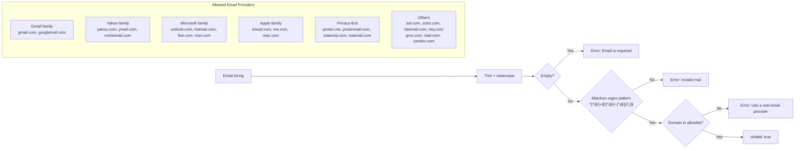
```mermaid
flowchart LR
    Input["Email string"] --> Normalize["Trim + lowercase"]
    Normalize --> Empty{"Empty?"}
    Empty -->|Yes| E1["Error: Email is required"]
    Empty -->|No| Pattern{"Matches regex pattern\n^[^@]+@[^@]+.[^@]{2,}$"}
    Pattern -->|No| E2["Error: Invalid mail"]
    Pattern -->|Yes| Domain{"Domain in allowlist?"}
    Domain -->|No| E3["Error: Use a real email provider"]
    Domain -->|Yes| Valid["isValid: true"]

    subgraph Allowlist["Allowed Email Providers"]
        direction TB
        G["Gmail family\ngmail.com, googlemail.com"]
        Y["Yahoo family\nyahoo.com, ymail.com, rocketmail.com"]
        M["Microsoft family\noutlook.com, hotmail.com, live.com, msn.com"]
        A["Apple family\nicloud.com, me.com, mac.com"]
        P["Privacy-first\nproton.me, protonmail.com, tutanota.com, tutamail.com"]
        O["Others\naol.com, zoho.com, fastmail.com, hey.com\ngmx.com, mail.com, yandex.com"]
    end
```

### Password Validation (`password-validation.ts`)

The password validator evaluates 8 independent criteria simultaneously, computing a strength score and surfacing the first failing rule as an error message.

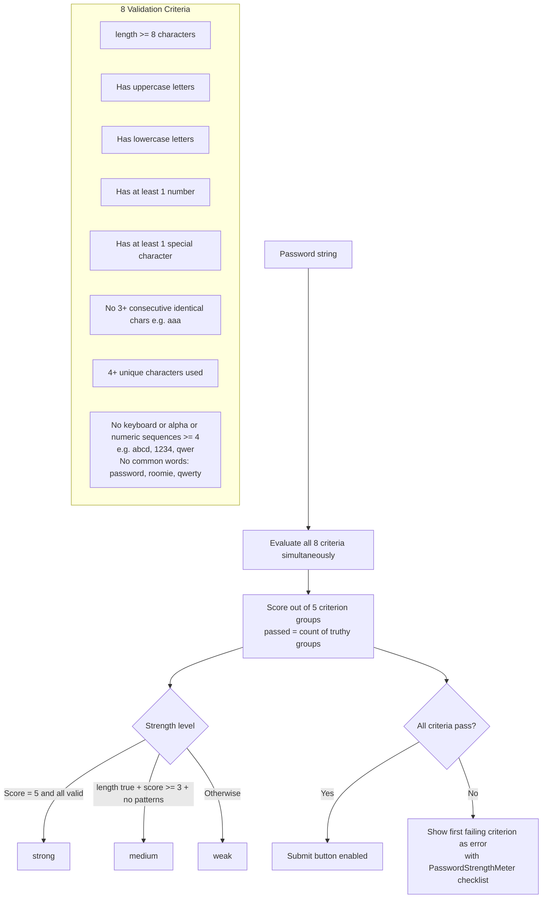
```mermaid
flowchart TD
    Input["Password string"] --> Criteria["Evaluate all 8 criteria simultaneously"]

    subgraph Eight_Criteria["8 Validation Criteria"]
        C1["length >= 8 characters"]
        C2["Has uppercase letters"]
        C3["Has lowercase letters"]
        C4["Has at least 1 number"]
        C5["Has at least 1 special character"]
        C6["No 3+ consecutive identical chars e.g. aaa"]
        C7["4+ unique characters used"]
        C8["No keyboard or alpha or numeric sequences >= 4\ne.g. abcd, 1234, qwer\nNo common words: password, roomie, qwerty"]
    end

    Criteria --> Score["Score out of 5 criterion groups\npassed = count of truthy groups"]

    Score --> Strength{"Strength level"}
    Strength -->|"Score = 5 and all valid"| Strong["strong"]
    Strength -->|"length true + score >= 3 + no patterns"| Medium["medium"]
    Strength -->|"Otherwise"| Weak["weak"]

    Score --> IsValid{"All criteria pass?"}
    IsValid -->|Yes| OK["Submit button enabled"]
    IsValid -->|No| FirstError["Show first failing criterion as error\nwith PasswordStrengthMeter checklist"]
```

**PasswordStrengthMeter** renders a 3-segment coloured bar (`weak` = red, `medium` = amber, `strong` = green) and a checklist of all 8 criteria with tick/cross icons — shown only when the user has started typing.

---

## 8. Key Design Decisions & Notes

### Authentication

| Decision | Rationale |
|----------|-----------|
| **Supabase SSR cookie-based sessions** | Enables secure server-side session reading without exposing tokens to JS. Prevents XSS token theft via `localStorage`. |
| **Singleton Supabase browser client** | Prevents multiple `GoTrueClient` instances which would cause session conflicts and unnecessary WebSocket connections. |
| **`onAuthStateChange` for client-side auth state** | Fires synchronously on mount from the existing cookie — no additional network round-trip needed to bootstrap auth state. `isLoading = true` until this fires, preventing any flash of unauthenticated UI. |
| **Email allowlist validation (not just regex)** | Blocks disposable/temporary email services (e.g. Mailinator, TempMail) commonly used by bad actors to create throwaway accounts. |
| **Google OAuth with `access_type: 'offline'` + `prompt: 'consent'`** | Forces Google to always issue a refresh token, preventing session expiry for long-term users. |
| **Password reset redirects through `/auth/callback`** | The callback route is the single code-exchange endpoint for all OAuth and magic-link flows, ensuring consistent session cookie setting. `/auth/reset-password` simply server-redirects to `/settings/password` for a clean URL experience. |

### Onboarding

| Decision | Rationale |
|----------|-----------|
| **`onboarding_step` persisted to DB at each step** | Allows users to resume mid-onboarding across devices and browser sessions without losing progress. The DB is the source of truth, not local state. |
| **Step routing logic duplicated in 3 places** | Root page (server RSC), OAuth callback (server route), and email sign-in (client) all need to route to the correct step independently. This is intentional — each entry point has a different runtime context (server vs. client). |
| **Verify step is optional (skippable)** | Lowering friction for new users — they can join the community immediately and verify later from their profile page. Both paths (submit + skip) call the same auto-connect logic. |
| **Auto-connect to official support account on completion** | Ensures every new user has a message waiting in their chat from day one, improving activation and providing an immediate support channel. The support account UUID is hardcoded (`a99928a0-8de7-4da0-871a-22077d13945d`). |
| **City-filtered university list** | Universities are filtered to those near the student's selected city (from the Basics step), reducing scroll fatigue for common Nigerian cities. Unlisted schools use a free-text "Other" fallback with state selector. |
| **Auto-generated username on first load** | `useProfile` auto-generates a username (`base + 2-digit random suffix`) on mount if missing, with up to 12 conflict-retry attempts. This prevents broken UI states where a `username` is null in profile display components. |

### Account Safety

| Decision | Rationale |
|----------|-----------|
| **`BarredCheck` as a global provider wrapper** | Sits inside the root layout provider chain, applying the barred check to every rendered page automatically — no per-page middleware or manual checks needed. |
| **`/appeal` and `/auth/*` excluded from barred redirect** | Barred users must still be able to log out and submit an appeal. These paths are explicitly excluded from the `BarredCheck` block condition. |
| **Appeals require document evidence** | Admin cannot approve or reject blind — a supporting document (student ID, registration letter, etc.) is required in every submission, reducing fraudulent reinstatement requests. Previous pending appeals are updated rather than creating duplicates. |

---

*This document reflects the current state of the codebase as of September 2026.*  
*Key source files:*
- [`apps/app/app/auth/`](file:///c:/Users/admin/Desktop/Roomie/apps/app/app/auth) — Auth page routes  
- [`apps/app/app/onboarding/`](file:///c:/Users/admin/Desktop/Roomie/apps/app/app/onboarding) — Onboarding wizard pages  
- [`apps/app/src/components/auth/`](file:///c:/Users/admin/Desktop/Roomie/apps/app/src/components/auth) — Auth UI components  
- [`apps/app/src/context/AuthContext.tsx`](file:///c:/Users/admin/Desktop/Roomie/apps/app/src/context/AuthContext.tsx) — Auth React context  
- [`apps/app/src/hooks/useProfile.ts`](file:///c:/Users/admin/Desktop/Roomie/apps/app/src/hooks/useProfile.ts) — Profile SWR hook  
- [`packages/db/src/types.ts`](file:///c:/Users/admin/Desktop/Roomie/packages/db/src/types.ts) — Full database type definitions  
